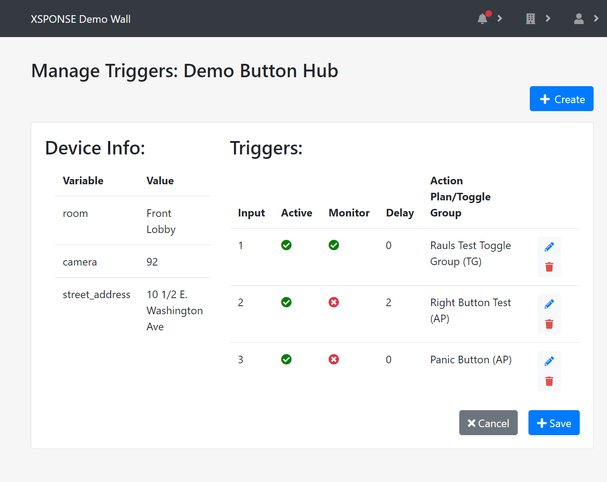
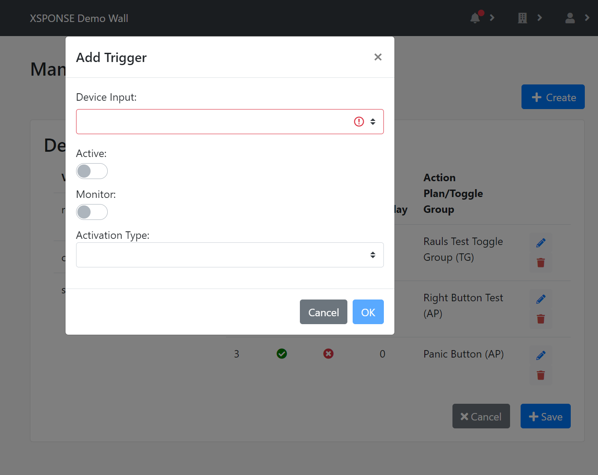

Related: [Action Plans](../general-ops/action-plans.md) \| [Device Toggle Groups](../general-ops/device-toggle-groups.md) \| [Incident Logs](../general-ops/incident-logs.md) \| [Contacts Management](../general-ops/contacts-management.md) 

*Jump to how to [add](button-consoles-management.md#add-a-button-console), [adjust](button-consoles-management.md#adjust-a-buttons-triggers), [edit](button-consoles-management.md#edit-a-buttons-information), or [delete](button-consoles-management.md#delete-a-button-console) a button console.*

The button consoles table shows the button consoles by description (name), along with the number of inputs each device has. 

_To view larger: on a computer, right-click and select "open in new tab"; on a mobile touchscreen, use the zoom gesture._

Each button console has four inputs, and each input can be assigned a single trigger. An input is _active_ when it has an assigned trigger, and _inactive_ if a trigger has not been created for it. An input can be set with a delay so that the input must be closed or activated for a certain number of seconds before it will send a trigger, such as a panic button that must be depressed for 2 seconds or a door sensor that detects when the door has been open for 30 seconds. Once a button input sends a trigger, it can activate a *device toggle group* or an *action plan*.
- A device toggle group allows multiple input and output devices to be grouped together so that triggering one of the input devices will cause the output devices to react. For example, a button console can be set to trigger if the button is held down for two seconds and cause relay consoles to activate flashing lights and sirens. See the [Device Toggle Groups page](../general-ops/device-toggle-groups.md) for more information.
- An action plan can be as simple as switching a relay console according to a schedule, for example allowing a set of lights to be turned on at nightfall and off at daybreak. Or it can incorporate the button console into a more detailed plan, such as automatically shutting a machine off and sending an alert by SMS when a button console is activated in an emergency. See the [Action Plans page](../general-ops/action-plans.md) for more information.

Inputs also can be monitored by the XSPONSE service for connectivity; with this setting, if an input is unplugged or loses connectivity, an alarm will be sent to the administrators.

## Add a button console
To add a button console and associate it with your account, select **Add Device** at the top right of the pane. This will open a separate pane asking you to enter the activation code for the device, which can be found on a sticker on the device. Enter the code and select **Submit**.  

_To view larger: on a computer, right-click and select "open in new tab"; on a mobile touchscreen, use the zoom gesture._

A new pane will open asking you to give the device a description (name), and to set its attributes. By default, devices start with two attributes, _room_ and _street address_.

_To view larger: on a computer, right-click and select "open in new tab"; on a mobile touchscreen, use the zoom gesture._

_Device attributes_ are user-defined variables that allow action plans to provide relevant information about which device is sending an alert. For example, for a large high school with multiple floors and buildings, all button consoles could have attributes named _room, floor,_ and _building,_ and unique values for each device that would indicate its specific location. An action plan would use those variable names as placeholders in the alert message; this way, many button consoles can be assigned to the same action plan. When a particular button triggers the action plan, its values for those attributes would fill those variables in the action plan’s message, so that the alert message would identify the specific room where the button console was activated. See the [Action Plans page](../general-ops/action-plans.md) for more information on using device attributes in action plans. 

Select the **Add Row** link to add more attributes or select the red **X** button at the end of a row to remove it. 

Once you have set these options, select **Submit** to accept the settings. To go back to the button consoles management page without linking a device, select **Cancel**.
 
## Edit a button’s information
To edit the information for a button console, select the **Edit** icon in the button consoles table. This will open a separate pane allowing you to edit the device description and attributes, including adding new attributes or removing existing ones. Select the **Add Row** link to add more attributes or select the red **X** button at the end of a row to remove it. Once changes are made, select **Submit** to accept the changes. Select **Cancel** to go back to the button consoles management pane without saving any changes.

## Delete a button console
To remove a button console, select the **Delete** icon in the button console table. This will open a separate pane asking you to confirm button deletion. Select **Delete** to delete the button console. Select **Cancel** to go back to the button consoles management pane without deleting the button console.

## Adjust a button’s triggers
To manage the triggers and action plans for a button console, select the **Adjust** icon in the button consoles table. This will open a separate pane allowing you to see the existing device attributes under _Device Info_ and the triggers in the _Triggers_ table. 

_To view larger: on a computer, right-click and select "open in new tab"; on a mobile touchscreen, use the zoom gesture._

To add a new trigger, select **Create** in the upper right of the pane. This will open a floating _Add Trigger_ window on top of the current pane. Select the **Device Input** menu to assign the trigger to an available input. Select **Active** to toggle the input between active and inactive. Select the **Delay Input** box to enter a delay in seconds for the trigger, if desired; by default this is set to zero. Select **Monitor** to toggle between active and inactive; by default this is set to inactive. When Monitor is active, XSPONSE will send an alarm to your administrator if the button console's connection drops. Select the **Activation Type** menu to choose between *Toggle Device Group* and *Activate Action Plan*. 
- If you choose *Toggle Device Group*, the button when activated will trigger a device toggle group, which can be used to activate multiple output devices such as relay consoles; select a toggle group from the **Device Toggle Group** menu. (See the [Device Toggle Groups page](../general-ops/device-toggle-groups.md) for more information.)
- If you choose *Activate Action Plan*, the button when activated will trigger an action plan, which can be used to control multiple devices, update displays, send alerts by text or email, and more; select an action plan from the **Action Plan** menu and set a **Delay Trigger** if desired. (See the [Action Plans page](../general-ops/action-plans.md) for more information.) 

Once changes are made, select **OK** to accept the changes, or select **Cancel** to close the window without saving changes. 

_To view larger: on a computer, right-click and select "open in new tab"; on a mobile touchscreen, use the zoom gesture._

To change an existing trigger, select the **Edit** icon in the triggers table. This will open the floating Add Trigger window. To remove an existing trigger, select the **Delete** icon in the triggers table.

Once changes to the triggers table are made, select **Save** to accept the changes. Select **Cancel** to go back to the button consoles management pane without saving any changes. **NOTE** that you _must_ select **Save** to keep any changes you make to the triggers, whether adding a new one, editing an existing one, or deleting one.

___
*Return to the [Button Consoles index](index.md)*
