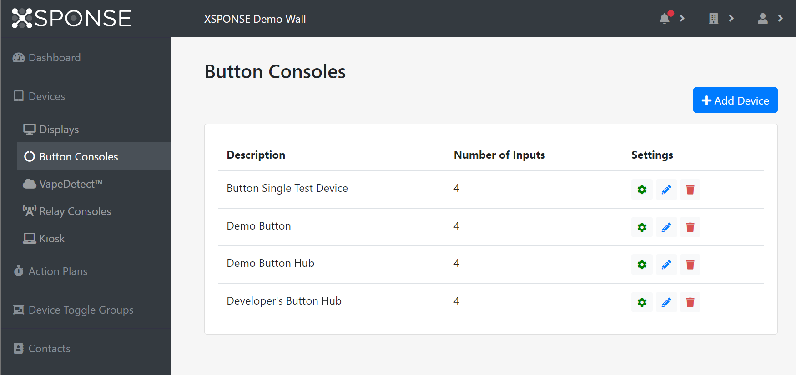

Related: [Action Plans](../general-ops/action-plans.md) \| [Incident Logs](../general-ops/incident-logs.md) \| [Contacts Management](../general-ops/contacts-management.md) 

*Jump to how to [add](button-consoles-management.md#add-a-button-console), [adjust](button-consoles-management.md#change-a-buttons-settings), [edit](button-consoles-management.md#edit-a-buttons-information), or [delete](button-consoles-management.md#delete-a-button-console) a button console.*

The button consoles table shows the button consoles by description (name), along with the number of inputs each device has. 

_To view larger: on a computer, right-click and select "open in new tab"; on a mobile touchscreen, use the zoom gesture._

Each button console has four inputs, and each input can be assigned a single trigger. An input is _active_ when it has an assigned trigger, and _inactive_ if a trigger has not been created for it. An input can be set with a delay so that the input must be closed or activated for a certain number of seconds before it will send a trigger, such as a panic button that must be depressed for 2 seconds or a door sensor that detects when the door has been open for 30 seconds. Once a button input sends a trigger, it activates an action plan, a user-configured set of actions in response to the trigger.

Inputs also can be monitored by the XSPONSE service for connectivity; with this setting, if an input is unplugged or loses connectivity, an alarm will be sent to the administrators.

## Add a button console
To add a button console and associate it with your account, select **Add Device** at the top right of the pane. This will open a separate pane asking you to enter the activation code for the device, which can be found on a sticker on the device. Enter the code and select **Submit**. A new pane will open asking you to give the device a description (name), and to set its attributes—by default at least one. 

_To view larger: on a computer, right-click and select "open in new tab"; on a mobile touchscreen, use the zoom gesture._

_Device attributes_ are user-defined variables that allow action plans to provide relevant information about which device is sending an alert. For example, for a large high school with multiple floors and buildings, all sensors could have attributes named _room, floor,_ and _building,_ and unique values for each sensor that would indicate its specific location. An action plan to alert staff when vaping is detected would use those variable names as placeholders in the alert message; this way, many devices can be assigned to the same action plan. When a particular sensor detects vaping and triggers the action plan, its values for those attributes would fill those variables in the action plan’s message, so that the alert message would identify the specific room where the sensor was activated. See the [Action Plans page](../general-ops/action-plans.md) for more information on using device attributes in action plans. 

Select the **Add Row** link to add more attributes or select the red **X** button at the end of a row to remove it. 

Once you have set these options, select **Submit** to accept the settings. To go back to the button consoles management page without linking a device, select **Cancel**.
 
## Change a button’s settings
To change the settings for a button console, select the **Adjust** icon in the button consoles table. This will open a separate pane allowing you to set whether the device is active and what action plan to follow when its trigger activates. Select **Active** to toggle the device between active and inactive. Select the **Action Plan** menu to choose a plan from those available. (See the [Action Plans page](../general-ops/action-plans.md) for more information.) Once changes are made, select **Save** to accept the changes. Select **Cancel** to go back to the button consoles management pane without saving any changes.

## Edit a button’s information
To edit the information for a button console, select the **Edit** icon in the button consoles table. This will open a separate pane allowing you to edit the device description and attributes. Once changes are made, select **Submit** to accept the changes. Select **Cancel** to go back to the button consoles management pane without saving any changes.

## Delete a button console
To remove a button console, select the **Delete** icon in the button console table. This will open a separate pane asking you to confirm button deletion. Select **Delete** to delete the button console. Select **Cancel** to go back to the button consoles management pane without deleting the button console.

___
*Return to the [Button Consoles index](index.md)*
