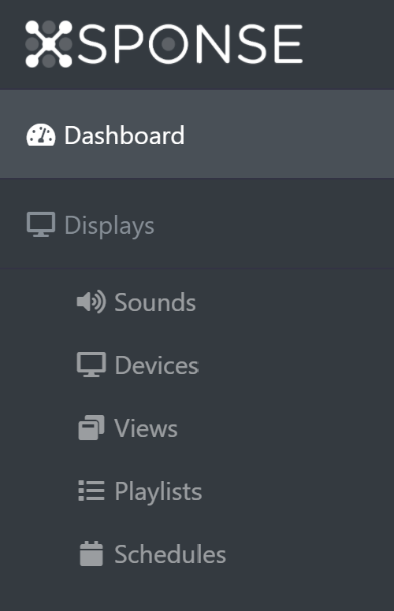

Before you get started, it is important to understand how the system is designed. We have four main components: displays, views, playlists, and schedules. 
- A _display_ is a physical piece of equipment that is used to show content programmed on our service—from instant alerts, such as emergency notices, to webpages, videos, and more. You must associate each display with your XSPONSE account before you can use it to show XSPONSE content. See the [Displays Management page](displays-management.md) for more information.
- A _view_ is a specific item of content shown on a display. It can be a webpage, image, YouTube video, PDF, or XSPONSE apps such as a countdown timer. See the [Views Management page](views-management.md) for more information. 
  Displays can also be set to play _sounds_ in connection with some content, such as the countdown timer. See the [Sounds Management page](sounds-management.md) for more information.
- A _playlist_ is a collection of views that can be organized and automatically displayed in a specific order. A display duration can be set for some view items, such as static images and PDFs, while the scrolling rate can be set for webpages. See the [Playlists Management page](playlists-management.md) for more information.
- A _schedule_ is the content programming for displays by day and time, repeating on a weekly basis. You can also create special one-time scheduled events that never repeat. See the [Schedules Management page](schedules-management.md) for more information.

You manage your XSPONSE service through the XSPONSE website, which provides a dashboard through which you can access each of these components. The site features a consistent look and feel, with every pane providing the same base functions, to make navigation easier. The components for the Digital Displays can be accessed through the Displays submenu in the navigation pane on the left side of every screen on the XSPOSNE site. See the [XSPONSE Site Overview page](general-ops/site-overview.md) and the [Dashboard page](general-ops/dashboard.md) for more information.

___
*Return to the [Digital Displays index](index.md)*
