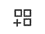

_\*For the rest of this page, "Digital Display" on its own refers to the combination of an HDMI display attached to a prepared Raspberry Pi device._

## Prepare a Digital Display
You will need a Raspberry Pi 4 with at least 2 GB RAM and a USB-C power supply and cable, as well as an HDMI-compatible display and an 8 GB microSD card and card reader. We recommend the Vilros Raspberry Pi 4 Basic Kit (B07TKFFCF1), which comes with a fan-cooled case, power supply, and micro-HDMI adapter; it's [available on Amazon](https://https://www.amazon.com/Vilros-Raspberry-Fan-Cooled-Heatsinks-Quickstart/dp/B07TKFFCF1). You will also need a desktop or laptop computer for downloading and installing the XSPONSE firmware onto the microSD card. Follow the full instructions on our [Display Device Setup page](display-device-setup.md).

When you have completed the instructions on the Display Device Setup page, your display should be showing the XSPONSE logo and a blue screen with an activation code, indicating that it is ready to be associated with an account. Follow the rest of the instructions on this page to associate your Digital Display with your XSPONSE account, and to create your ArtDrive account and link it to your Digital Display.

## Join the XSPONSE service
Once your Digital Display is prepared, you will need to link it to an XSPONSE service account. From your computer, tablet, or smartphone browser, go to [manage.xsponse.com](https://manage.xsponse.com).

**If you do not yet have an XSPONSE account:**  
Select **Sign up**. In the new window, enter your first name, last name, email address, and password (following the guidelines), then select **Sign Up** to create your account. This will return you to the Login page with the message "Your account has been created. Please Login."

**If you have an XSPONSE account:**  
Enter your email address and password and select **Login**. 

The first time you log in to your new account, you will need to read through and accept the Privacy Policy and the Terms of Service. (On both pages, you may also choose to select **Logout** if you are not prepared to complete this process at the time, but you will have to read and accept the Privacy Policy and Terms of Service when you return to login and complete the process.)

Once you have accepted both the Privacy Policy and Terms of Service, the XSPONSE service dashboard will appear. The dashboard is the home page for managing your XSPONSE service and devices. For full information on the XSPONSE website interface and the dashboard, see the [XSPONSE Site Overview page](../general-ops/site-overview.md) and the [Dashboard page](../general-ops/dashboard.md). ***For now, continue with the following instructions.***

## Link your Digital Display
From the XSPONSE dashboard, in the navigation pane along the left side, select **Displays** to expand the _Displays_ menu and then select **Devices** to go to the Displays management pane. 

In the upper right of the pane, select **Link a Display**. In the Link a Display pane, enter the activation code showing on your Digital Display and select **Submit**. 

A new pane will appear asking you to give the device a description (a name or location), select the time zone for the display, set its orientation (which typically you can leave set to "landscape"), and set the content to show. If you have not set up a Digital Display before, in the **Content** list select **Default Playlist**. Once you have set these options, select **Submit** to accept the settings. You will return to the Displays management pane, and your new device will be listed in the Displays table. Also, your Digital Display should now be showing the default playlist, which consists of the Google News webpage, an image of the Space Shuttle launching, and an image of an Abraham Lincoln quote, each showing for 30 seconds at a time in rotation.

## Link an ArtDrive account
Once your Digital Display is set up and connected to the XPSONSE service, you can link your XSPONSE account to an ArtDrive account. 

**If you do not yet have an ArtDrive account:**  
From your computer, tablet, or smartphone browser, go to [myartdrive.com](https://myartdrive.com). In the upper right of the website, select **Sign Up**.\* In the dialog box that appears, enter your email address, a password, your name, and a display name (which will appear on any galleries you mark as public), then select **Sign Up** to create your account. A new _Verify Account_ dialog box will appear, directing you to check the email account you used to register; you should receive an email with a link to verify your address. Selecting the link in the email will open an ArtDrive login page in your browser; log in again to copmlete the verification. You will need to complete this verification so that you can create your own galleries on ArtDrive.  
\*(Alternately, you can select **Sign in with Google** to use your existing Google account as your ArtDrive account.)  

**Once you have an ArtDrive account:**  
Return to your XSPONSE dashboard at [manage.xsponse.com](https://manage.xsponse.com). At the upper right of the dashboard, above the main pane, select the icon of a person to open the **Users** menu and in the menu select **Profile**. In the Profile pane, under _Linked Accounts_, select **Connect to ArtDrive**. The ArtDrive website will appear with a login dialog box. Log in to your ArtDrive account, and on the next page select **Authorize** to confirm that you want to provide xsponse.com access to your ArtDrive galleries. Once you authorize the connection, your XSPONSE profile pane will reload with ArtDrive listed as a linked account. Select **Dashboard** above the profile information to return to the main XSPONSE dashboard.

## Add an ArtDrive gallery
Once you've made an ArtDrive account, on the [ArtDrive website](https://myartdrive.com) you will need to create at least one gallery of artwork to show on your Digital Display. (Note that you must have verified your email address as described previously before you can create a gallery.)  
When searching the ArtDrive collection, below each artwork to the right is the **Add to Gallery** icon, which looks like three squares with a plus sign:  
  
Select this icon and in the _Add to Gallery_ dialog box, select the **Select Gallery** list and choose **Create New Gallery**. Enter the name of your new gallery and select **OK**. The new gallery will be created and the artwork added to it. As you continue browsing the ArtDrive collection, when you select additional artworks, your new gallery will appear in the **Select Gallery** list; you can always choose to create additional galleries as well.

Once you have at least one ArtDrive gallery with one artwork in it, you can set your Digital Display to show the gallery. First, you'll need to create a _view_, which is a specific type of content to be shown on a display.  
1. Return to your [XSPONSE dashboard](https://manage.xsponse.com) and under **Displays** in the navigation pane, select **Views** to go to the Views management pane.  
2. To add a view, select **Create View** at the top right of the pane. This will open the View Library pane showing all the available view types.  
3. Select **Art Drive Gallery**, which will open a new pane to create the view.  
4. In the _Description_ field, enter a name to identify the view; this is how it will be listed when you set the options for your Digital Display to show it. Your ArtDrive account should already be listed under _Art Drive Account;_ if it is not, be sure you have completed the process to [Link an ArtDrive account](artdrive-quickstart.md#link-an-artdrive-account) detailed previously. Select the **Gallery** list and choose the gallery you've created on ArtDrive. If your gallery has multiple artworks, you can use the _Display Order, Number of Images to Show,_ and _Time to Display Each Image_ settings to control how the artworks are shown. (_Text Display_ and _QR Code Display_ provide additional options, but you can ignore those for now.)  
5. Once you've finished with the settings, select **Submit**. The Views management pane will reappear with your new view listed in the Views table.

Finally, you can set your Digital Display to show this new ArtDrive gallery view.  
1. In the navigation pane, select **Devices** under the **Displays** menu to return to the Displays management pane. Your new Digital Display will be listed in the Displays table.  
2. In the _Manage_ column, select the **Edit** icon (the blue pencil) to open the Configure pane for that device.  
3. Select the **Content** list, scroll down if necessary to _Views_, and select the new ArtDrive view you just created.  
4. Select **Submit** to save the changes and return to the Displays management pane. Your Digital Display should now be showing the ArtDrive gallery view you created.

**Congratulations!** You have now set up your Digital Display, created an ArtDrive gallery, and set your Digital Display to show the artworks you chose. 

With your Digital Display setup complete, you now have other options to use as well. See the [Views Management page](views-management.md) for full information on all the different content types you can show on your Digital Display. (Some views let you [add and use sounds](sounds-management.md) as well.) See the rest of the [Digital Displays Guide](index.md) for more information on how to [manage your Digital Displays](displays-management.md), [create and use playlists](playlists-management.md) to show multiple views on one display, and [create and use schedules](schedules-management.md) to manage when you show various views and playlists. 

___
*Return to the [Digital Displays index](index.md)*
