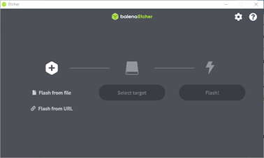

The XSPONSE Digital Display service uses inexpensive Raspberry Pi hardware and our custom XSPONSE software to create a cloud-connected device that enables you to create and manage digital signage for many purposes.

## Requirements
To set up your XSPONSE Digital Display, you will need:
-	A Raspberry Pi 4 with a minimum 2 GB RAM (such as the Vilros VR4B2GBBK008 or equivalent), and a USB-C power supply and cable.
-	A display with an HDMI connector.
-	An HDMI cable and micro-HDMI adapter.
-	An Internet connection through either a Cat 5 (Ethernet) cable or a wireless network.
-	A microSD card with at least 8 GB storage (and a card reader for your computer).

Additionally, you will need to have a computer available to download and run [balenaEtcher](https://www.balena.io/etcher/) to flash the XSPONSE software onto the microSD card.

## Install the firmware
1. Go to the XSPONSE software page at [xsponse.com/downloads](https://www.xsponse.com/downloads) and download the latest XSPONSE Digital Display firmware.
2. On the same computer, if you haven't already, download and install [balenaEtcher](https://www.balena.io/etcher/).
3. Put the 8-GB microSD card into a card reader attached to the same computer.
4. Start balenaEtcher.
5. Select the Digital Display firmware file you've downloaded as the image file, and select the microSD card as the target drive.  
  
6. Select **Flash** and wait for balenaEtcher to unpack the contents of the image file onto the microSD card.
7. Once the flash process is done, remove the microSD card from the reader and insert it into the memory slot of the Raspberry Pi.

## Set up the display device
1. Connect the Raspberry Pi device to a display through the HDMI cable (and make sure you set the display to use that input). 
2. If you are connecting to the Internet through a wired network, connect the Ethernet cable to the device.
3. Connect the power supply to an outlet and the power cable to the device. 
4. Connect the device to the Internet through your network. The network must have DHCP enabled and must be able to connect through the cloud to [xsponse.com](https://xsponse.com). If you are using a firewall to control access to your network, please make sure \*.xsponse.com is enabled. The display uses standard web APIs, so no special ports need to be opened. 

When the device starts, it will display the XSPONSE logo and a blue screen with an activation code, indicating that it is ready to be associated with an account. See the [Displays Management page](displays-management.md) for how to associate your display device with the XSPONSE service. If you have not yet created an administrator account with XSPONSE, first see the [Getting Started page](../general-ops/account-setup.md) in the [XSPONSE Service Guide](../general-ops/index.md).

___
*Return to the [Digital Displays index](index.md)*
