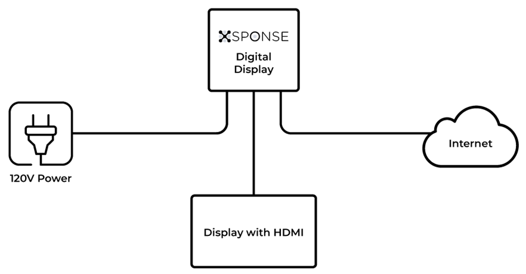

To set up your XSPONSE Digital Display, you will need:
-	An Internet connection.
-	A display with an HDMI connector.
-	A Cat 5 (Ethernet) cable (not included with the XSPONSE device).
-	An HDMI cable (included with the device).
-	The power supply and power cable (included with the device).

Connect the device to the Internet using a Cat 5 (Ethernet) cable. Then connect the device to any display that has an HDMI input (and make sure you set the display to use that input). Finally, plug the power supply into the device and turn it on. When the device starts, it will display a blue screen indicating that it is ready to be associated with an account.

See the [Displays Management page](displays-management.md) for how to associate your display device with the XSPONSE service.
___
*Return to the [Digital Displays index](index.md)*
