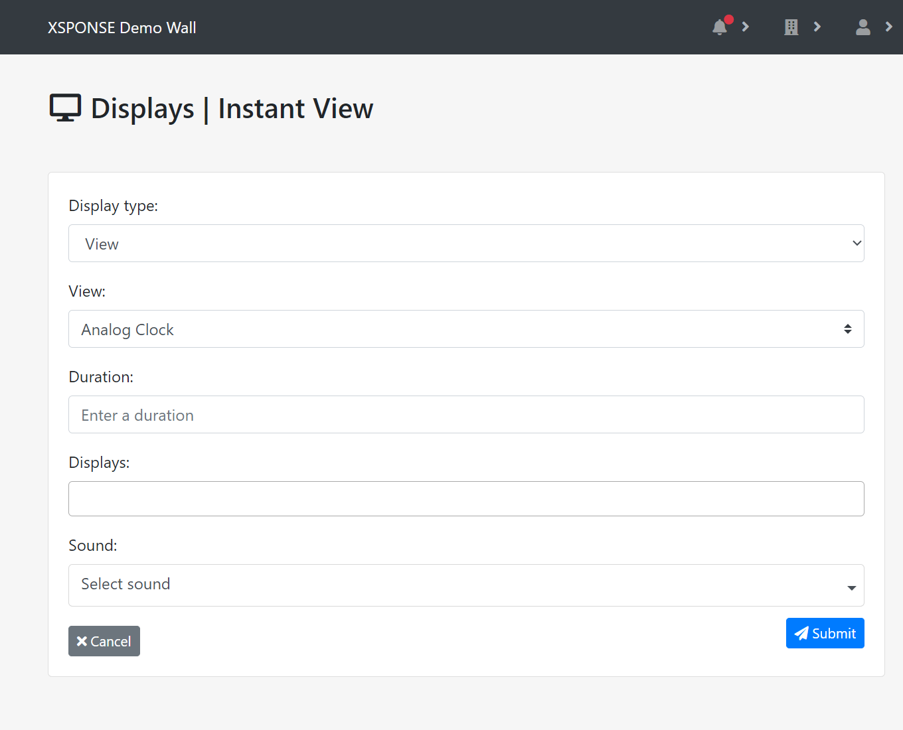

*Jump to how to [add](displays-management.md#add-a-display), [edit](displays-management.md#edit-a-display), [restart](displays-management.md#restart-a-display), or [delete](displays-management.md#delete-a-display) a display.*

The Displays table shows the display descriptions (names), the version of code each is running, and when the service last received a signal from each display (“last seen”). 

_To view larger: on a computer, right-click and select "open in new tab"; on a mobile touchscreen, use the zoom gesture._

When a display device starts, it checks the XSPONSE system to see whether it is associated with an account. If the display is not associated with an account, it will show a blue screen with an activation code. Entering that code into the Link a Display pane accessed through the Displays management pane (as described next) will associate the display with your account. Once the display is associated with your account, you can set it to show a specific view, run a playlist, or run a schedule. See the [Views Management page](views-management.md), [Playlists Management page](playlists-management.md), and [Schedules Management page](schedules-management.md) for more information. You can also send an *instant view* to an associated display, overriding its current content. See [Instant views](displays-management.md#instant-views) later on this page for more information.

## Add a display
To add a display, select **Link a Display** at the top right of the pane. This will open a separate pane asking you to enter the activation code shown on the display. 

_To view larger: on a computer, right-click and select "open in new tab"; on a mobile touchscreen, use the zoom gesture._

Enter the code and select **Submit**. A new pane will open asking you to give the device a description (name), select the time zone for the display, set its orientation (landscape or portrait—you can also flip the display depending on how it is set up), and set the content to show a view, playlist, or schedule. 

_To view larger: on a computer, right-click and select "open in new tab"; on a mobile touchscreen, use the zoom gesture._

If you have not yet created any views, in the **Content** list select **Default Playlist**. (The default playlist consists of the Google News webpage, an image of a Space Shuttle launching, and an image of an Abraham Lincoln quote, each showing for 30 seconds at a time in rotation.) To learn more about the different types of content you can display and how to add them, see the [Views Management page](views-management.md). Once you have set these options, select **Submit** to accept the settings. To go back to the Displays management pane without linking a device, select **Cancel**.
 
## Edit a display
To edit a display, select the **Edit** icon in the Displays table. This will open a separate pane allowing you to edit the display description, time zone, orientation, and content. Once changes are made, select **Submit** to accept the changes. Select **Cancel** to go back to the Displays management pane without saving any changes.

## Restart a display
To restart a display, select the **Restart** icon in the Displays table. This will open a separate pane asking you to confirm that you want to restart that display. Select **Reboot** to restart the display. Select **Cancel** to go back to the Displays management pane without restarting the display.

## Delete a display
To remove a display, select the **Delete** icon in the Displays table. This will open a separate pane asking you to confirm display deletion. Select **Delete** to delete the display. Select **Cancel** to go back to the Displays management pane without deleting the display.

## Instant views
The *instant view* feature allows you to replace whatever content a display is currently showing with new content from your existing set of views or with a webpage, and trigger a sound at the same time. This feature can be used for a variety of purposes, such as to alert people of breaking news or other information that's not part of a regularly scheduled program. To set up an instant view, select **Send Instant View** above the Displays table. This will open a separate pane to set the parameters.

_To view larger: on a computer, right-click and select "open in new tab"; on a mobile touchscreen, use the zoom gesture._

In the Instant View pane, select **Display type** to choose between a view or a URL. If you choose URL, the *URL* field will appear; fill in the URL of the website you want to show. If you choose View, the *View* list will appear and you can select one of the available views from your existing set. (To create or modify views, see the [Views Management page](views-management.md).) Enter a duration for the instant view to stay visible. Select the **Displays** field to choose which displays should show the instant view; you can select this field multiple times to add as many displays as you have available, or select the X before a display name in the field to remove it. Select the **Sound** list if you want to choose a sound to play with the instant view. Select **Submit** to accept your settings and make the instant view active. Select **Cancel** to go back to the Displays management pane without sending the instant view.

___
*Return to the [Digital Displays index](index.md)*
