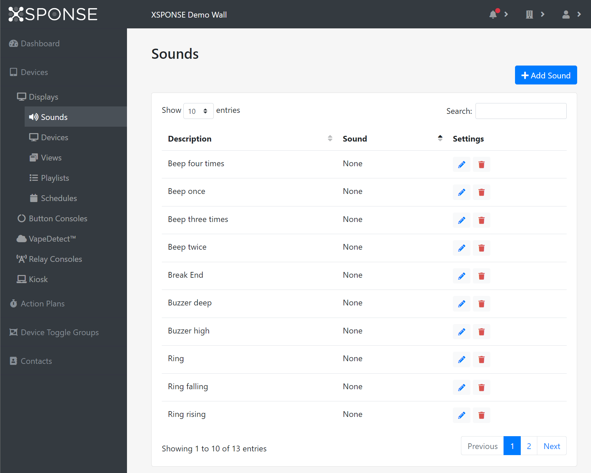
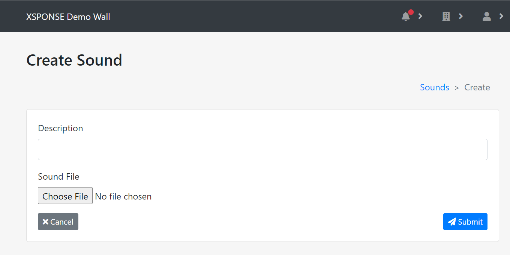

*Jump to how to [add](sounds-management.md#add-a-sound), [edit](sounds-management.md#edit-a-sound), or [delete](sounds-management.md#delete-a-sound) the sounds.*
 
Certain views allow you to play a sound on a display. For example, in the countdown timer, you can program the display to play specific sounds during the countdown. See the [Views Management page](views-management.md) for more information. The base service contains several sounds that we have created and provide free of charge. The Sounds table shows the available sounds by description (name). You can delete or edit these sounds if you wish, as well as add new sounds. XSPONSE supports .wav and .mp3 file types, with a size limit of 5 MB per file. 

_To view larger: on a computer, right-click and select "open in new tab"; on a mobile touchscreen, use the zoom gesture._

## Add a sound
To add a sound, select **Add Sound** at the top right of the pane. This will open a separate pane allowing you to provide a description of the sound and to provide the sound file. 

_To view larger: on a computer, right-click and select "open in new tab"; on a mobile touchscreen, use the zoom gesture._

Select **Submit** to save the new sound file. Select **Cancel** to go back to the Sounds management pane without saving the sound.

## Edit a sound
To edit a sound, select the **Edit** icon in the Sounds table. This will open a separate pane allowing you to change the description of the sound file and upload a new audio file if you wish. Once changes are made, select **Submit** to accept the changes. Select **Cancel** to go back to the Sounds management pane without saving any changes.

## Delete a sound
To delete a sound, select the **Delete** icon in the Sounds table. This will open a separate pane asking you to confirm sound deletion. Select **Delete** to delete the sound. Select **Cancel** to go back to the Sounds management pane without deleting the sound.

___
*Return to the [Digital Displays index](index.md)*
