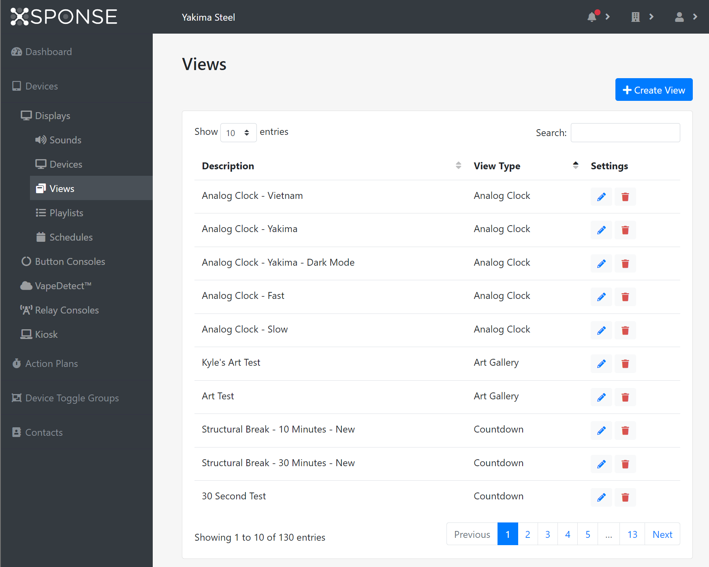
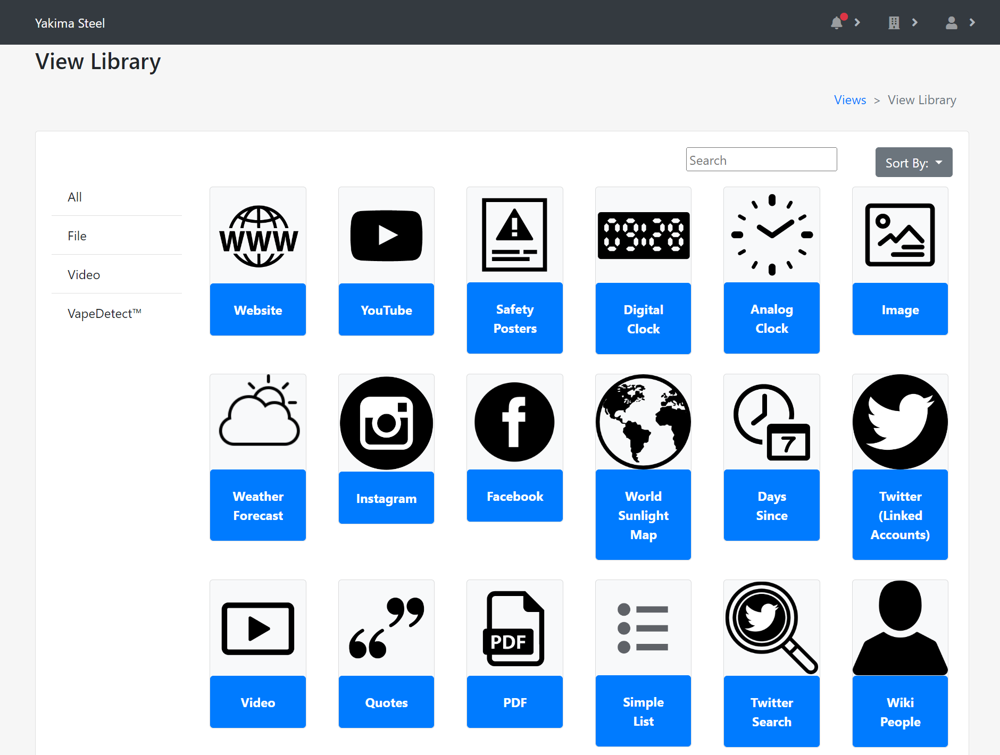

*Jump to how to [add](views-management.md#add-a-view), [edit](views-management.md#edit-a-view), or [delete](views-management.md#delete-a-view) a view.*
 
A view is the content to be shown on a display—such as a website, image, PDF file, video file, or YouTube video. We also have several built-in apps such as a countdown timer and days since last accident poster. A display can be set directly to show a specific view; see the [Displays Management page](displays-management.md#edit-a-display) for more information. Views can also be arranged in playlists to show multiple views in a particular order and duration; see the [Playlists Management page](playlists-management.md) for more information. 

Some view types, such as the countdown timer, allow you to play sounds in connection with the view. See the [Sounds Management page](sounds-management.md) for more information on adding, editing, and deleting sounds.

The Views table shows the views by description (name), and each view’s type (such as image or website). For content such as websites, images, and PDF files, selecting the link in the Description column of the Views table will open a separate browser tab with the contents of the view. Some of the built-in app view types, such as the countdown timer, cannot be viewed in a browser, so the link will not work.

## Add a view
To add a view, select **Create View** at the top right of the pane. This will open the View Library pane showing all the available view types. Select the **Sort By** menu in the upper right of the pane to list the views alphabetically, by newest (most recently added), or by most popular.

Select the view you want to create to continue. Each view type has its own settings that need to be supplied to create the view, as detailed later on this page. Once the settings have been entered, select **Submit** to create the new view. Or to go back to the Views management pane without creating a new view, click the **Views** link in the upper right of this pane or in the navigation pane.

Some view types, such as image, PDF, and video, allow you to upload files to the XSPONSE server. The XSPONSE service supports all “image” MIME file types, PDF files (the “application/pdf” MIME type), and .mp4, .webm, and .ogg files for video. Files uploaded to the XSPONSE server are limited to 20 MB each for image or PDF files and 1 GB for video files, with a maximum of 10 GB data storage space for all file types per user account. 

The settings for the different view types are as follows: 

### Analog Clock
_Description:_ Add a simple text description of the analog clock, which is how it will be listed in the Views table.

_Time Zone:_ By default, this option is set to use the device's default time zone; select **Choose a time zone** to choose a different one from the list. Also by default, the _Display timezone?_ option is set to **No**; select this list to change it to **Yes**.

_Choose a Date Format:_ By default, this option is set to **Don't display date**; select this list to choose a format if you want to display the date.

_Animation Speed:_ Select the speed for the animation of the seconds hand on the clock—the **Slow** setting will make it tick forward each second, while the **Fast** setting will make it move smoothly and continuously forward. 

_Write Text to Display a Caption (optional):_ Enter text in this box if you want to provide a caption with the clock.

### Art Drive Gallery
The Art Drive gallery allows you to choose images from your own Art Drive account to show on a display, automatically cycling through the chosen pieces. 

_Description:_ Add a simple text description of the gallery, which is how it will be listed in the Views table.

_Art Drive Account:_ Enter your Art Drive account.

_Gallery:_ Select the gallery from your Art Drive account to use as the source for images.

_Display Order:_ Select whether to show your images in a **Random** order, **Oldest to Newest**, or **Newest to Oldest**.

_Number of Images to Show:_ Enter the number of images to be shown.

_Time to Display Each Image:_ Select this box to set the duration in hours, minutes, and seconds.

For the remaining options, select **Expand** to show the options, and when expanded select **Collapse** to hide them again.

_Text Display:_ This option allows you to display any text associated with the images. Select the _Display Type_ list to choose from **Fade Out**, **Always Show Text**, or **No Text**. If Fade Out is selected, use the _Time to Display Text_ box to set the duration in hours, minutes, and seconds. 

_QR Code Display:_ This optoin allows you to display the QR codes associated with the images. Select the **Display QR Code** list to choose from **Fade Out**, **Always Show Text**, or **No Text**. If Fade Out is selected, use the **Time to Display QR Code** box to set the duration in hours, minutes, and seconds. 

### Art Gallery
The art gallery allows you to choose images from a preset collection of artworks included with the XSPONSE service to show on a display, automatically cycling through the chosen pieces.

_Description:_ Add a simple text description of the gallery, which is how it will be listed in the Views table.

_Time that Each Image Will be Displayed:_ Select this box to set the duration in hours, minutes, and seconds.

_Number of Selected Images to Display:_ Enter the number of images to be shown.

_Display Artist Name and Art Title:_ By default, this option is set to **No**. Select this box and select **Yes** to activate this feature and reveal three additional options. _Seconds Before Fade_ determines how long the information text will stay onscreen before fading out of view. The other two options, _Display Right or Left_ and _Bottom or Top,_ together will position the text accordingly in one of the four corners of the screen.

The lower section of options allows you to search through the provided collection of artworks. To view the entire collection, select **Search** without filling in any options. To add an image to the gallery, select the image in the search results; thumbnails of these images will then appear within the options section. To remove an image from the gallery, select the image in the options section. 

### Countdown
The countdown timer measures the time remaining in hours, minutes, and seconds, with a maximum setting of 23:59:59. See the following [Generic Countdown Timer](views-management.md#generic-countdown-timer) for periods longer than 24 hours.

The countdown timer allows you to play one or more sounds and messages as the timer reaches specific points in the countdown. This could be used for example to pace an hour-long test by playing one sound every 15 minutes, a second sound as a five-minute warning before the hour is up, and a third sound to mark the end of the hour (and countdown).

_Description:_ Add a simple text description of the timer, which is how it will be listed in the Views table.

_Duration:_ Set the overall duration for the timer in hours, minutes, and seconds.

_Text to Speech:_ Add a simple text message that will be read aloud by the text-to-speech feature and a time point when that message should be heard. Select **+ row** to add the first message and select it again to add more messages to be read aloud at additional time points. Select the **Delete** icon at the end of the row or select **– Last row** to remove an entry.

_Message:_ Add a simple text message to show on the device and a time point when that message should appear. Select **+ row** to add the first message and select it again to add more messages to be shown at additional time points. Select the **Delete** icon at the end of the row or select **– Last row** to remove an entry.

_Sounds:_ Select a sound from the list to play and a time point when that sound should play. Select **+ row** to add the first sound and select it again to add more sounds to be read aloud at additional time points. Select the **Delete** icon at the end of the row or select **– Last row** to remove an entry.

### “Days Since” Poster
_Description:_ Add a simple text description of the poster, which is how it will be listed in the Views table.

_Last Accident:_ Select or type the date of the last incident.

_Record:_ Add the number of days for the longest period between accidents. If no entry is made in this field, the poster by default will show the number of days since the date in the Last Accident field.

### Digital Clock
_Description:_ Add a simple text description of the digital clock, which is how it will be listed in the Views table.

_Background Color_ and _Text Color:_ Select each box to choose a color from the palette for the two elements of the clock. By default both colors are set to black; you will need to select and change at least one color so the time is visible.

_Google Font:_ Select this list to choose the font for the display. 

### Generic Countdown Timer
The generic countdown timer allows you to count down to a specific date as well as time, and creates a stylized webpage to show the countdown. Various text display options allow you to customize the countdown information to be shown.

_Description:_ Add a simple text description of the timer, which is how it will be listed in the Views table.

_End Date:_ Select or type the date for the timer to finish.

_End Time:_ Select or type the time of day for the timer to finish.

_Background Source:_ Select an image or video to display in the background of the timer.

The remaining options are set to **No** or **None** by default. To view and change the options, select **Expand** next to the option you want; when expanded, select **Collapse** to hide the option again.

_Background After Timer Completes:_ This option lets you select a different image or video to display in the background after the timer completes.

_Title Display, Body Display, Sub Body Display:_ Select **Text** to enter text to be shown and to select the font size and type for the text. Select **Image** to choose from the list of available images.

_Day Display, Hour Display, Minute Display, Second Display:_ These options let you display and specify the singular and plural forms of words to go with the countdown. You can use these options to customize the display text to a particular language or multiple languages. Alternately, select **Image** to choose from the list of available images.

### Google Photos Album
The Google Photos Album allows you to choose images from your own Google Photos account to show on a display, automatically cycling through the chosen pieces. 

_Description:_ Add a simple text description of the gallery, which is how it will be listed in the Views table.

_Google Photos Account:_ Enter your Google Photos account.

_Album:_ Select the album from your Google Photos account to use as the source for images.

_Display Order:_ Select the order to show your images: **Random**, **In Order** (as per the album), **Reverse Order**, **Oldest to Newest**, or **Newest to Oldest**.

_Time to Display Each Image:_ Select this box to set the duration in hours, minutes, and seconds.

_Number of Images to Show:_ Enter the number of images to be shown.

### Image 
_Description:_ Add a simple text description of the image, which is how it will be listed in the Views table.

_Choose File:_ Select **Choose File** to browse for the file you want to display. The file will be uploaded to the XSPONSE server. The XSPONSE service supports all “image” MIME file types. Image files uploaded to the XSPONSE server are limited to 20 MB each. 

### List
_Description:_ Add a simple text description of the list, which is how it will be listed in the Views table.

_Title:_ Add a simple text description of the list to be shown on the display. 

_Sort By:_ Select the sorting method for the list.

_Extra fields:_ Select this menu to choose additional information to be displayed in the list. Multiple fields may be selected. Select the **X** next to the field name to remove it from the set.

_Filters:_ Select **Expand** to show the filters you can use for choosing which items show in the list. Select a filter on the **Due Date** menu and select additional options from _Status, Priority,_ and _List;_ if the _Due Date_ option is either “In the next” or “In the last”, then the _Days_ option will appear as well. Select **Collapse** to hide the filters.

_Scroll Speed:_ If the list is long and doesn’t entirely fit on the screen at once, you can use this option to scroll through the list. Note: If you are using playlists (see the [Playlists Management page](playlists-management.md)) and want to ensure the list scrolls all the way to the end, do not enter a duration in the playlist view. If you do enter a duration in the playlist, the list will scroll but when the duration has expired, the playlist will immediately move to the next view regardless of whether or not the list has scrolled to the bottom.

_Scroll Start Delay:_ Set the number of seconds you want the view to pause before it starts scrolling down through the list.

_Wait At Bottom:_ Set the number of seconds you want the view to pause when the list has scrolled completely to the end.

### PDF 
_Description:_ Add a simple text description of the file, which is how it will be listed in the Views table.

_Choose File:_ Select **Choose File** to browse for the file (“application/pdf” MIME type) you want to display. The file will be uploaded to the XSPONSE server. PDF files uploaded to the XSPONSE server are limited to 20 MB each. 

_Scroll Speed:_ If the PDF has multiple pages and doesn’t fit on the screen all at once, you can use this option to scroll through the PDF. Note: If you are using playlists (see the [Playlists Management page](playlists-management.md)) and want to ensure the PDF scrolls all the way to the end, do not enter a duration in the playlist view. If you do enter a duration in the playlist, the PDF will scroll but when the duration has expired, the playlist will immediately move to the next view regardless of whether or not the PDF has reached the end.

_Scroll Start Delay:_ Set the number of seconds you want the view to pause before it starts scrolling.

_Wait At Bottom:_ Set the number of seconds you want the view to pause when the PDF has scrolled completely to the end.

### QR Code
The QR code view allows you to generate a QR code to show on a display, for various purposes: to open a webpage, send an SMS, send an email, add a vCard, or connect to a WiFi network.

_Description:_ Add a simple text description of the QR code, which is how it will be listed in the Views table.

_Choose the QR Code Content:_ Select this list to choose from the following content types and their options:

> _URL:_ Enter the website URL in the box.
> 
> _SMS:_ Enter the recipient's number and a text message to send.
> 
> _Email:_ Enter the recipient's email address, a subject, and a text message.
> 
> _vCard:_ Enter the first name, last name, position or profession, email address, and website URL to be included in the vCard.
> 
> _WiFi:_ Enter the network name, the encryption type in use, and the network password if necessary.

_QR Designs:_ Following the content section, the QR Designs section lets you choose options for the appearance of the QR Code page. By default _Page Background_ is set to **Solid Color** and you can select **Choose Background Color** to change it with the color picker. Alternately, select **Page Background** to change it to **User Content**, which then shows the _User Content_ list to choose from the available images or videos for a background. In either case, you can also choose what kind of frame to use for the code, the overall color for the code itself (from a limited list of black, purple, red, blue, or green), and whether or not to display your logo on the QR code.

_Enter a title text_ and _Enter a body text:_ Enter the text you wish to show on the page with the QR code.

### Quotes
_Description:_ Add a simple text description of the file, which is how it will be listed in the Views table.

_Number of quotes to display:_ Enter the number of quotes to be shown.

_Time to display each quote:_ Select this box to set the duration in hours, minutes, and seconds.

_Background Images:_ Select an image to use for the background.

_Quote Search:_ Use the _Author, Category, Sub Category,_ and _Tags_ filters in this section to find the quotes you want to include in the view. Once you have set the filters, select **Search Quotes**. Any available results will appear in the _Unselected_ box. Select a quote in this box and select **Add** to add it to the _Quotes to Display_ box. To remove a quote from the display group, select the quote in the _Quotes to Display_ box and select **Remove**.

### Safety Posters
The safety posters view allows you to choose posters from a preset collection to show on a display, automatically cycling through the chosen posters.

_Description:_ Add a simple text description of the poster gallery, which is how it will be listed in the Views table.

_Time that Each Image Will be Displayed:_ Select this box to set the duration in hours, minutes, and seconds.

_Number of Selected Images to Display:_ Enter the number of images to be shown.

The lower section of options allows you to search through the provided collection of posters. To view the entire collection, select **Search** without filling in any options. You can add keywords to the _Image Search: Keywords_ box to filter search results, and also use the _Image Orientation_ option to filter results to either portrait or landscape. To add a poster to the set for the view, select the poster in the search results; thumbnails of these posters will then appear within the options section. To remove a poster from the set for the view, select the poster in the options section. 

### Simple List
The simple list view lets you create a basic list of items to display.

_Description:_ Add a simple text description of the list, which is how it will be listed in the Views table.

_Title:_ Add a simple text description of the list to be shown on the display. 

_Background color, Card color,_ and _Text color:_ Select each box to choose a color from the palette for the item. _Card color_ allows you to put a card-like frame around the list itself. 

_List:_ Select **+Row** to add an item to the list, by entering text in the text box that appears. Note that by default the list has no rows; you must add at least one row for the list to display anything. Select **+Row** again to add more items; select **-Last row** to remove the item currently at the end of the list; or select the **Delete** icon at the end of a row to remove that item from the list while keeping any rows before and after it.

### Tasks
_Description:_ Add a simple text description of the task, which is how it will be listed in the Views table.

_Task:_ Select the arrow to expand the list of available tasks.

### Task Manager
_Description:_ Add a simple text description of the task manager, which is how it will be listed in the Views table.

_Title:_ Add a simple text description of the task manager to be shown on the display. 

### VapeDetect Dashboard
_Description:_ Add a simple text description of the VapeDetect dashboard, which is how it will be listed in the Views table. For example, this could indicate the location of the device, such as “second floor bathroom”.

_Left Text:_ Add text to be shown on the left side of the dashboard header, such as the location of the device.

_Center Text:_ Add text to be shown in the center of the dashboard header, such as the company name.

_Vape Detect Device:_ Select the device to be used as the source for the dashboard’s data.

### VapeDetect Graph

_Description:_ Add a simple text description of the file, which is how it will be listed in the Views table.

_Subtext One:_ Add the subtext for the graph.

_Subtext Two:_ Add the subtext for the graph.

_Graph Options:_ Select this menu to choose the information to be shown in the graph. Multiple fields may be selected. Select the **X** next to the field name to remove it from the set.

_Vape Detect Device:_ Select the device to be used as the source for the graph data.

### Video 
_Description:_ Add a simple text description of the file, which is how it will be listed in the Views table.

_Choose File:_ Select **Choose File** to browse for the file you want to display. The file will be uploaded to the XSPONSE server. The XSPONSE service supports .mp4, .webm, and .ogg file types. Video files uploaded to the XSPONSE server are limited to 1 GB each. 

### Website
> **Note on websites and pop-up windows:**
> Please try to avoid websites that initiate pop-up windows. We have no control over those and can’t dismiss the pop-up. If you add a website that has a pop-up, it will appear for the duration that the site is being shown.

_Description:_ Add a simple text description of the website, which is how it will be listed in the Views table.

_URL:_ Add the URL for the website.

_Scroll Speed:_ If the webpage doesn’t fit on the screen all at once, you can use this option to scroll through the page. Note: If you are using playlists (see the [Playlists Management page](playlists-management.md)) and want to ensure the webpage scrolls all the way to the end, do not enter a duration in the playlist view. If you do enter a duration in the playlist, the webpage will scroll but when the duration has expired, the playlist will immediately move to the next view regardless of whether or not the webpage has reached the end. 

_Scroll Start Delay:_ Set the number of seconds you want the screen to show before it starts scrolling.

_Wait At Bottom:_ Set the number of seconds you want the screen to show when the page has scrolled completely to the bottom of the screen.

### YouTube
_Description:_ Add a simple text description of the YouTube video, which is how it will be listed in the Views table.

_Video:_ Add the URL of the YouTube video.

_Start:_ Set the number of seconds into the video where you want it to start. By default, it will start at the beginning (0 seconds).

_End:_ Set the number of seconds into the video where you want it to end. Leave this setting blank to let the video play through to the end.

_Mute:_ Select this check box to mute the audio if desired.

## Edit a view
To edit a view, select the **Edit** icon in the Views table. This will open a separate pane allowing you to edit the attributes of the view. Once changes are made, select **Submit** to accept the changes. Select **Cancel** to go back to the Views management pane without saving any changes.

## Delete a view
To delete a view, select the **Delete** icon in the Views table. This will open a separate pane asking you to confirm view deletion. Select **Delete** to delete the view. Select **Cancel** to go back to the Views management pane without deleting the view.

___
*Return to the [Digital Displays index](index.md)*
