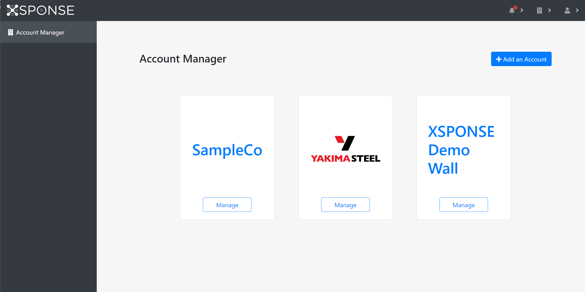

*Jump to how to [add a company account](account-manager.md#add-a-company-account) or [change a company's account information](account-manager.md#change-a-companys-account-information).*

The Account Manager pane shows tiles for the organizations associated with your account—by default one, possibly more. An individual user whose XSPONSE account is not associated with a company will see instead their account's email address listed in a tile.

_To view larger: on a computer, right-click and select "open in new tab"; on a mobile touchscreen, use the zoom gesture._
 
To continue, select **Manage** in the appropriate tile for your company or account. This will take you to the dashboard for that company. See the [Dashboard page](dashboard.md) for more information about the dashboard and see the [XSPONSE Site Overview page](site-overview.md) for more information on the general interface of the XSPONSE site.

Additionally, from this pane company account administrators can add new companies and edit the information for their companies.

## Add a company account
To create a new company account, select **Add an Account** in the upper right of the main pane. This will open a separate pane allowing you to fill out the information for the new organization. You can also upload an image file of the organization’s logo. All “image” MIME file types are supported, and the file may be up to 1 MB in size. (This logo will appear in the company’s tile on the Account Manager pane and can be used in the screensaver feature of XSPONSE Digital Displays.) Select **Submit** to save the new organization account. Select **Account Manager** in the navigation pane to go back to the Account Manager pane without saving any changes.

## Change a company’s account information
To change the information for a company, select the **Accounts** icon in the top right of the pane to show the menu of companies you can manage and select the **Adjust** (gear) icon next to a company name. This will open a separate pane allowing you to update the organization’s information. Select **Submit** to save the changes. (Note that this will take you to the company dashboard rather than the Account Manager pane; see the [Dashboard page](dashboard.md) for more information.) Once you have submitted the changes, you can always select the **Manage all Accounts** link in the Accounts menu to return to the Account Manager pane. To go back to the Account Manager pane without saving any changes, in the top right corner select the **Accounts** icon and then select the **Manage all Accounts** link.

___
*Return to the [XSPONSE Service Guide index](index.md)*
