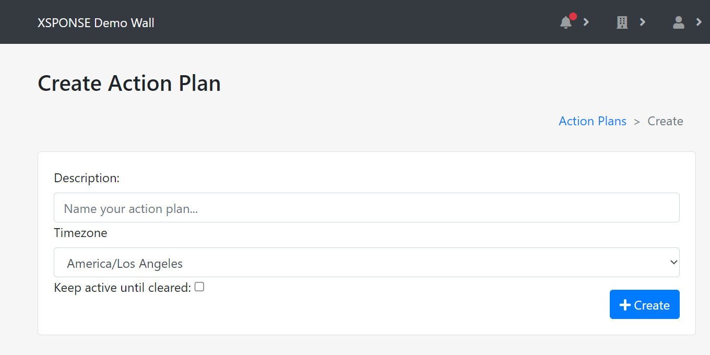

Related: [Incident Logs](incident-logs.md) \| [Contacts Management](contacts-management.md) \| [About VapeDetect](../vape-detect/about-vapedetect.md) \| [VapeDetect Management](../vape-detect/vapedetect-management.md) \| [About Button Consoles](../button-consoles/about-button-consoles.md) \| [Button Consoles Management](../button-consoles/button-consoles-management.md) \| [About Relay Consoles](../relay-consoles/about-relay-consoles.md) \| [Relay Consoles Management](../relay-consoles/relay-consoles-management.md)

*Jump to how to [add](action-plans.md#create-an-action-plan), [edit](action-plans.md#edit-an-action-plan), or [delete](action-plans.md#delete-an-action-plan) action plans.*

An action plan is a set of one or more actions that happen automatically in response to a trigger event, such as a VapeDetect sensor sending an alert about vaping activity or a button console being activated. These actions can include sending email or SMS, activating a third-party API, posting information on an associated XSPONSE Digital Display device, or toggling a relay between on and off. An action plan can also be set to a schedule, so for example an XSPONSE Relay Console could be used to turn a set of lights on at nightfall and off at daybreak.

The Action Plans table shows the action plans by description (name), along with whether the plan is an alert or an alarm, the number of actions set to happen when the plan is triggered, and the number of actions set to happen when the plan is cleared. There are two basic types of actions, those that happen automatically when an action plan is triggered (_On Activate_), and those that happen when a user acknowledges the activated action plan by marking it clear (_On Clear_). An action plan listed as "Alert" only has On Activate actions, while a plan listed as "Alarm" has both On Activate and On Clear actions. 

_To view larger: on a computer, right-click and select "open in new tab"; on a mobile touchscreen, use the zoom gesture._

Each time an XSPONSE device triggers an action plan, the information is recorded in the incident logs. The Incident Logs management pane allows you to view all recorded incidents from all your devices. Select the **Incident Logs** button above the Action Plans table to go to the Incident Logs management pane and view the incidents. See the [Incident Logs page](incident-logs.md) for more information about the incident logs and the Incident Logs management pane.

## Create an action plan
To add an action plan, select **Create Action Plan** at the top right of the pane. This will open a separate pane allowing you to enter a description (name) for the plan, set the timezone used for scheduling and for recording events in the incident log, and choose whether to keep the plan active until cleared. Note that the **timezone** menu is set to "America/Los Angeles" by default; be sure to adjust this setting to match where your device is physically located. Once you have set these options, select **Create** to create the new plan. Or to go back to the Action Plans management pane without creating a new action plan, select the **Action Plans** link in the upper right of this pane or in the navigation pane. 

_To view larger: on a computer, right-click and select "open in new tab"; on a mobile touchscreen, use the zoom gesture._

Once you create an action plan, the pane will reload and display the Update _\[action plan\]_ pane, which allows you to set what actions should happen when a plan is triggered and to create a schedule for the action plan if desired. Each plan can have multiple actions, and each action has its own settings that need to be defined. No actions are added by default, and if you are not ready to add any at this point, you again have the option to select the **Action Plans** link in the upper right (or in the navigation pane) to return to the Action Plans management pane. Your new action plan will appear in the table, and you can add actions to the plan later by selecting the **Edit** icon for that plan in the Action Plans table. 

_To view larger: on a computer, right-click and select "open in new tab"; on a mobile touchscreen, use the zoom gesture._

#### Schedules
By default, actions in an action plan take effect according to when the XSPONSE service receives a relevant trigger event from a device. You can also create a schedule with _action windows,_ which allows you to assign actions to be available during specific periods of time every week. For example, you could have a Send Email action for certain administrators set to happen during school hours, and Send SMS for security set to happen after school. Or you could set alerts to go to a different administrator each day of the week, to spread out monitoring duties.

To add a schedule, select **Edit Action Plan Schedule** at the top right of the pane, which will open a separate pane to create the schedule. 
- To create an action window in the schedule, select any timeslot on the calendar. In the floating "Add Window to Schedule" dialog box that appears, select the days of the week, set a start time, set the end time, and add a description (name) for the action window. (Note that although the timeslots by default start at every half-hour, you can set the start and end times to any minute of the hour.) Once you have set the action window parameters, select **Submit** to close the dialog box and save the action window. Select **Cancel** (or the **X** in the upper-right corner) to close the window without saving changes. ***Note:*** When you fill in the _description_ field, it stays active until you either click elsewhere in the dialog box or press Enter.
- To create a second action window that overlaps or coincides with an existing one, just select any open timeslot to open the "Add Window to Schedule" dialog box, and then set the parameters as appropriate, then select **Submit**. The new action window will appear adjacent to the existing one in the column for each day they overlap. Note that you must select an open timeslot in order to add a new action window; if you have filled the entire schedule, all 24 hours across all 7 days, with one action window, you would not be able to add a second action window until you edited the first one to make an open timeslot.
- To edit an action window, select the action window on the schedule. In the floating "Edit Window on Schedule" dialog box that appears, make your changes to the parameters and select **Submit** to close the dialog box and save the changes. 
- To delete an action window, select the action window on the schedule. In the floating "Edit Window on Schedule" dialog box that appears, select **Remove** to delete a saved action window.

#### Device attributes
Some actions allow you to use _device attributes_, which are user-defined variables that allow action plans to provide relevant information about which device is sending an alert. By default, devices have two attributes, _room_ and _street\_address_, and you can add more. For example, for a large high school with multiple floors and buildings, all sensors could have attributes named _room_, _floor_, and _building_, and the unique values for each sensor would indicate its specific location. An action plan to alert staff when vaping is detected would use those variable names as placeholders in the alert message; this way, many devices can be assigned to the same action plan. When a particular sensor detects vaping and triggers the action plan, its values for those attributes would fill those variables in the action plan’s message, so that the alert notification would identify which specific sensor was activated. 

Attributes can be used in texts, emails, and notifications. To insert an attribute, include \{\{device._attributename_\|safe\}\} in the appropriate place in the message. When the action plan is activated, the service will look for these and substitute in the attribute value for that particular device. For example, to substitute in the room in a text message, you would add \{\{device.room\|safe\}\} in the text message, like this:

> Vape Detected: \{\{device.room\|safe\}\}

#### Adding actions
To begin setting up the action plan, select **Add Action** in the Actions pane. Creating an action happens automatically in steps. 

1. First, provide a name (description) of the action.
2. Next, select an action from the menu: **Send Email**, **Send SMS**, **Send Mobile Notification**, **Call 3rd Party API**, **Update Digital Display**, **Clear Active Digital Displays**, **Control Relay**, or **Control VapeDetect Relay**. Each action can be assigned to happen during a particular time period—an active window—or by default to no active window, which means any time the service receives a trigger from an assigned device. For details on using schedules with action plans, see [Schedules](action-plans.md#schedules) previously.
3. Each of these actions has its own settings to fill out in a third and possibly fourth step, as described further along on this page. Once the settings for that action have been added, select **Submit** to create the new action. Or to go back to the Update _\[action plan\]_ pane without saving any changes, select the **Actions** link in the upper right.
4. Once you have added all the actions you want in the action plan for now, select the **Action Plans** link in the upper right (or in the navigation pane) to go back to the Action Plans management pane.

The settings for the different actions are as follows:

### Send Email
This action can be used in an action plan on its own or in conjunction with any XSPONSE devices. For example, it could be used simply to send a weekly reminder to fill out timesheets, or to send a daily confirmation that a set of lights was turned on or off through an XSPONSE Relay Console in the same action plan. 

_Recipients:_ Select the box to choose a recipient from the menu. This menu will include everyone in your XSPONSE contacts list, regardless of whether or not they have an email address included, so be sure that the selected recipients have an email address included in their entry in the Contacts table on the Contacts Management pane. (See the [Contacts Management page](contacts-management.md) for more information.) You can also select the box and start typing a name. As you type, the menu will update to show the best matches, or will display “No results found” if the characters typed don’t produce a match. To add multiple recipients, select the box again to choose another recipient (or to type). To remove a recipient, select the **X** next to their name in the box.

_Email Subject_ and _Email Body:_ Once you have chosen at least one recipient, you can fill in the subject and body of the email to be sent. You must provide some content in both fields to create this action. Device attribute names can be used as placeholders in both the subject and body, allowing the email to be customized at the time the alert is triggered with the information specific to the device that was activated. See [Device attributes](action-plans.md#device-attributes) previously for details. 

### Send SMS
This action can be used in an action plan on its own or in conjunction with any XSPONSE devices. For example, it could be used simply to send a weekly reminder to fill out timesheets, or to send a daily confirmation that a set of lights was turned on or off through an XSPONSE Relay Console in the same action plan. 

_Recipients:_ Select the box to choose a recipient from the menu. This menu will include everyone in your XSPONSE contacts list, regardless of whether or not they have a phone number included, so be sure that the selected recipients have a phone number included in their entry in the Contacts table on the Contacts Management pane. (See the [Contacts Management page](contacts-management.md) for more information.) You can also select the box and start typing a name. As you type, the menu will update to show the best matches, or will display “No results found” if the characters typed don’t produce a match. To add multiple recipients, select the box again to choose another recipient (or to type). To remove a recipient, select the **X** next to their name in the box.

_Message Body:_ Once you have chosen at least one recipient, you can fill in the body of the message to be sent. You must provide some content in this field to create this action. Device attribute names can be used as placeholders in the message body, allowing the message to be customized at the time the alert is triggered with the information specific to the device that was activated. See [Device attributes](action-plans.md#device-attributes) previously for details.

### Send Mobile Notification
This action can be used in an action plan on its own or in conjunction with any XSPONSE devices. For example, it could be used simply to send a weekly reminder to fill out timesheets, or to send a daily confirmation that a set of lights was turned on or off through an XSPONSE Relay Console in the same action plan. 

_Recipients:_ Select the box to choose a recipient from the menu. This menu will include everyone in your XSPONSE contacts list, regardless of whether or not they have a phone number included, so be sure that the selected recipients have a phone number included in their entry in the Contacts table on the Contacts Management pane. (See the [Contacts Management page](contacts-management.md) for more information.) You can also select the box and start typing a name. As you type, the menu will update to show the best matches, or will display “No results found” if the characters typed don’t produce a match. To add multiple recipients, select the box again to choose another recipient (or to type). To remove a recipient, select the **X** next to their name in the box.

_Message Body:_ Once you have chosen at least one recipient, you can fill in the body of the message to be sent. You must provide some content in this field to create this action. Device attribute names can be used as placeholders in the message body, allowing the message to be customized at the time the alert is triggered with the information specific to the device that was activated. See [Device attributes](action-plans.md#device-attributes) previously for details.

### Call 3rd Party API
This action can be used to send information to a third-party API in response to an event.

_Request URL:_ Add the URL for the API.

_Request Headers:_ Add the headers for the API.

_Request Body:_ Add the body for the API.

You must provide content in all three of these fields to create this action.

### Update Digital Display
If you have an XSPONSE Digital Display associated with your account, you can use this action to set it to show a view (content) and optionally play a sound for a length of time you choose. This action overrides the normal settings for the display in the Displays Management pane, so that the display can show timely and important information in an emergency or other event. See the [Digital Displays section](../digital-displays/about-digital-displays.md) for more information.

_To view larger: on a computer, right-click and select "open in new tab"; on a mobile touchscreen, use the zoom gesture._

_Duration:_ Set the overall length of time for the view to be shown.

_Display:_ Select a display device from the menu to show the view. All active displays associated with your account will be available in the menu.

_Sound (Optional):_ Select a sound from the menu to play while the view is being shown. The base XSPONSE service includes several sounds which will always appear in this menu, and any sounds you have added will appear as well. For more information, see your Digital Display Quick Start Guide. 

_View Type:_ Select a view from the menu to be shown. Once you select a view type, additional fields will appear for you to choose the settings for that view type.
- **View:** This option allows you to choose a predefined view from those you have added to your service. Select a view from the menu.
- **URL:** This option allows you to display a webpage even if you have not predefined it as a view. Enter the URL for the webpage in the field.
- **Custom:** This option allows you to create a custom text message to show on the display. 

_Background Color_ and _Text Color:_ You may choose both the background color and the text color, but you must change at least one of the two colors from the default setting (black) so that the text will be visible. Select the color field to change the color settings. Select the hue, saturation, and lightness for the color you want, and select the **check mark** button on the left to confirm your settings. Note that if the saturation is set all the way to the left (minimum saturation), only shades of gray will be visible, regardless of the hue setting. Or, if the lightness is set all the way to the left (minimum lightness—black) or to the right (maximum lightness—white), only black or white will be visible, regardless of the hue or saturation settings.

_Header Text_ and _Body Text:_ You must provide some content in both the header text and body text fields to create this action.

### Clear Active Digital Displays
If you have an XSPONSE Digital Display associated with your account, you can use this action to clear the views (content) being displayed on all Digital Displays active at the time the action is triggered. This action has no settings of its own. See the [Digital Displays section](../digital-displays/about-digital-displays.md) for more information.

### Control Relay
If you have an XSPONSE Relay Console associated with your account, you can use this action to control the relay automatically on a schedule or in response to other events such as an XSPONSE button being pressed. See the [Relay Consoles section](../relay-consoles/about-relay-consoles.md) for more information.

_To view larger: on a computer, right-click and select "open in new tab"; on a mobile touchscreen, use the zoom gesture._

_Device:_ Select a device from the list.

_Relay:_ Select which relay, from 1 to 4, to activate.

_State:_ Select whether the relay should turn on or off when the action happens.

_Delay State Change (ms):_ Select the number of milliseconds the state change should be delayed—by default no delay (0 milliseconds). Select the **Temporary State Change** check box to revert the relay to its original state after a set amount of time. Selecting this check box will cause the Hold State (ms) option list to appear.

_Hold State (ms):_ Select the number of milliseconds the state should remain in its new setting before reverting back to the previous state. This option only appears if the **Temporary State Change** check box is selected.

### Control VapeDetect Relay
If you have an XSPONSE VapeDetect sensor associated with your account, you can use this action to switch the sensor on or off automatically on a schedule or in response to other events such as an XSPONSE button being pressed. See the [VapeDetect section](../vape-detect/about-vapedetect.md) for more information.

_Device:_ Select a device from the list.

_State:_ Select whether the relay should turn on or off when the action happens.

_Delay State Change (ms):_ Select the number of milliseconds the state change should be delayed—by default no delay (0 milliseconds). Select the **Temporary State Change** check box to revert the relay to its original state after a set amount of time. Selecting this check box will cause the Hold State (ms) option list to appear.

_Hold State (ms):_ Select the number of milliseconds the state should remain in its new setting before reverting back to the previous state. This option only appears if the **Temporary State Change** check box is selected.

## Edit an action plan
To edit an action plan, select the **Edit** icon in the Action Plans table. This will open a separate pane allowing you to update the action plan. 
-	Select **Edit Action Plan Schedule** at the top right of the pane to create or edit a schedule for the plan, as described previously under [Schedules](action-plans.md#schedules).
-	Select **Add Action** above the Actions table to add a new action, as described previously under [Create an action plan](action-plans.md#create-an-action-plan). 
-	Select an **Edit** icon in the Actions table to change the settings for that action, as described previously. 
-	Select a **Delete** icon in the Actions table to remove that action from the plan. This will open a separate pane asking you to confirm the action deletion. Select **Delete** to delete the action or select **Cancel** to go back to the Update _\[action plan\]_ pane without deleting the action.

If you change the description of the action plan or change the **Keep active until cleared** check box, you must select **Save** in the upper panel to confirm the changes. Changes in the Actions table—adding, editing, or deleting actions for the plan—are saved as you complete them, and do not require you to select Save in the upper panel. Once all changes are made, select the **Action Plans** link in the upper right (or in the navigation pane) to go back to the Action Plans management pane.

## Delete an action plan
To delete an action plan, select the **Delete** icon in the Action Plans table. This will open a separate pane asking you to confirm the action plan deletion. Select **Delete** to delete the action plan. Select **Cancel** to go back to the Action Plans management pane without deleting the action plan.

___
*Return to the [XSPONSE Service Guide index](index.md)*  
*Return to the [VapeDetect index](../vape-detect/index.md)*  
*Return to the [Button Consoles index](../button-consoles/index.md)*  
*Return to the [Relay Consoles index](../relay-consoles/index.md)*  
