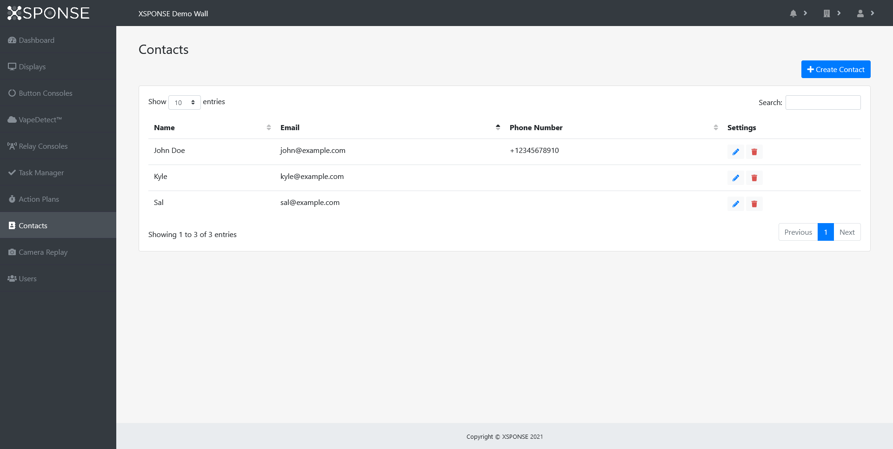

Related: [Action Plans](action-plans.md) \| [About the VapeDetect system](../vape-detect/about-vapedetect.md) \| [About Button Consoles](../button-consoles/about-button-consoles.md) \| [About Relay Consoles](../relay-consoles/about-relay-consoles.md) 

*Jump to how to [add](contacts-management.md#add-a-contact), [edit](contacts-management.md#edit-a-contact), or [delete](contacts-management.md#delete-a-contact) contacts.*

Contacts are the people who can be assigned to receive emails or SMS messages when an action plan is triggered. For example, a security guard can be included in the list and sent an SMS when an XSPONSE button is pressed to indicate an emergency. Contacts do not have to be registered as users of the XSPONSE service. 

_To view larger: on a computer, right-click and select "open in new tab"; on a mobile touchscreen, use the zoom gesture._

The Contacts table shows the contacts by name, along with their email address and phone number. 

Note that a contact could be included in an action plan even if the necessary information is missing from their entry in the XSPONSE system. For example, a contact listed with a phone number but no email address will still show up in the menu of contacts available for the _Send Email_ action. Therefore, it's important to be sure the necessary information is included when adding a contact. See the [Action Plans page](action-plans.md) for more information. 

## Add a contact
To add a contact, select **Create Contact** at the top right of the pane. This will open a separate pane allowing you to provide the name, email address, and phone number for the contact. (Note: the Tags field functionality is not currently implemented, and will be added in a future update.) You must include at least either an email address or a phone number to create the contact. Select **Submit** to save the new contact. Select the **Contacts** link in the upper right of the page (or in the navigation pane) to go back to the Contacts management pane without saving the contact.

## Edit a contact
To edit a contact, select the **Edit** icon in the Contacts table. This will open a separate pane allowing you to change the contact information. Once changes are made, select **Submit** to accept the changes. Select the **Contacts** link in the upper right of the page (or in the navigation pane) to go back to the Contacts management pane without saving the contact.

## Delete a contact
To delete a contact, select the **Delete** icon in the Contacts table. This will open a separate pane asking you to confirm contact deletion. Select **Delete** to delete the contact. Select **Cancel** to go back to the Contacts management pane without deleting the sound.

___
*Return to the [XSPONSE Service Guide index](index.md)*  
*Return to the [VapeDetect index](../vape-detect/index.md)*
*Return to the [Button Consoles index](../button-consoles/index.md)*  
*Return to the [Relay Consoles index](../relay-consoles/index.md)*  
