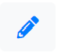
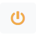
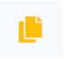
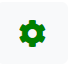
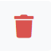

The main pane shows the relevant content for the page you have selected in the navigation pane. For the dashboard, this includes an overview of the company, featuring the last event detected, total events detected, account alerts, and a table of all your devices.
-	Select the **View event** link in the Last Event Detected box to see details on the event. This will open a new page with the incident information. See the [Incident Logs section](incident-logs.md) for more information.
-	Select the **View all** link in the Events Detected box to see the full log of events. This will open the Incident Logs page. See the [Incident Logs section](incident-logs.md) for more information.
-	Select the **View all** link in the Account Alerts box to see details on the account alerts. The account alerts notify you when one of your associated devices is disconnected.

The events are produced as part of the action plans feature, which works in conjunction with certain XSPONSE devices that can be set to send an instant alert to the XSPONSE server under certain conditions. For example, an environmental sensor could be set to react when temperature, humidity, or particles in the air reach certain thresholds. A button in an industrial lab could be set when pressed to send emergency notice of a chemical spill. Or a vapor sensor in a school washroom could send an alert when vaping is detected. In each case, the instant alert feature can trigger an action plan to perform various functions, such as sending email or text messages to the appropriate authorities and showing emergency notifications on displays. This part of the dashboard’s main pane will only show content if you have the relevant XSPONSE devices set up and associated with your account, and can be ignored otherwise.

## About dashboard management tables

The dashboard (and each other management page) has a table showing the items managed on that page—users, sensor devices, action plans, and so on. For the dashboard, the table shows all the devices associated with that company listed by description (name), device type, and when the service last received a signal from the device (“last seen”). The table can be sorted by each of these columns by selecting the arrows next to the column heading. You can search the table by typing in the search box; it will update in real time to show the entries relevant to what you type. You can select how many entries you want to see on the page from the **Show _[X]_ entries** menu at the upper left. If there are more entries in the table than your selection, you can scroll through the pages by selecting the **Previous** and **Next** buttons at the lower right of the page. The “Manage” column shows the icons for managing the various items in a table: a blue pencil for _Edit_, a yellow power symbol for _Restart_, a yellow document stack for _Copy_, a green gear for _Adjust_, and a red trash can for _Delete_.

| Icon | Action |
| --- | --- |
|  | Edit |
|  | Restart |
|  | Copy |
|  | Adjust |
|  | Delete |

Only the relevant icons are included for an item—for example, the Restart icon only appears for displays.

## View or change the company account information

The company administrator, or other users who have been granted the account administrator role (see the [Users section](users-management.md) for more information), can view or change the information for a company from the dashboard. Select the **Adjust** icon in the upper right of the dashboard main pane (or next to the company name in the **Accounts** menu in the top right of the page). (Note that users without the administrator role will not see the Adjust icon on the dashboard.) This will open a separate page where you can view and make changes to the basic company account information. You can also upload an image file of the organization’s logo. All “image” MIME file types are supported, and the file may be up to 1 MB in size. (This logo will appear in the company’s tile on the Account Manager page and can be used in the screensaver feature of XSPONSE Digital Displays.) Select **Submit** to save the changes and return to the company dashboard. Select the **Dashboard** link in the navigation pane to go back to the company dashboard without saving any changes.

___
*Return to the [XSPONSE Service Guide index](index.md)*
