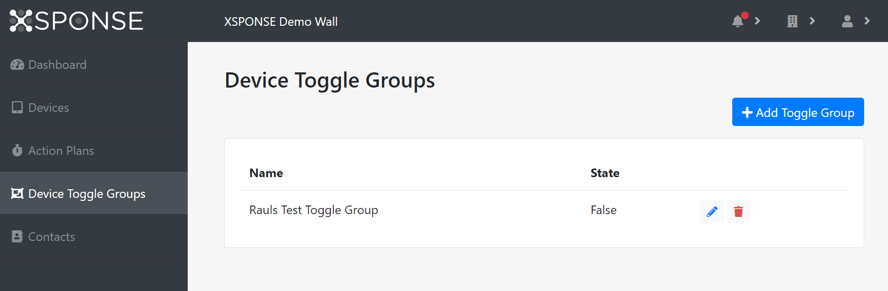
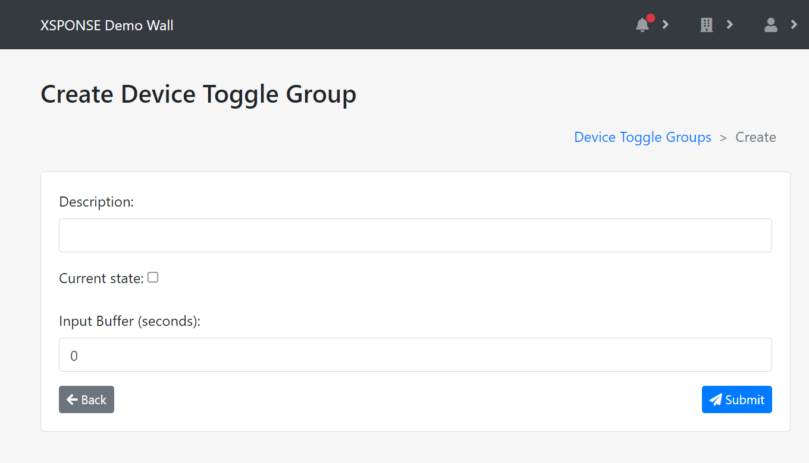
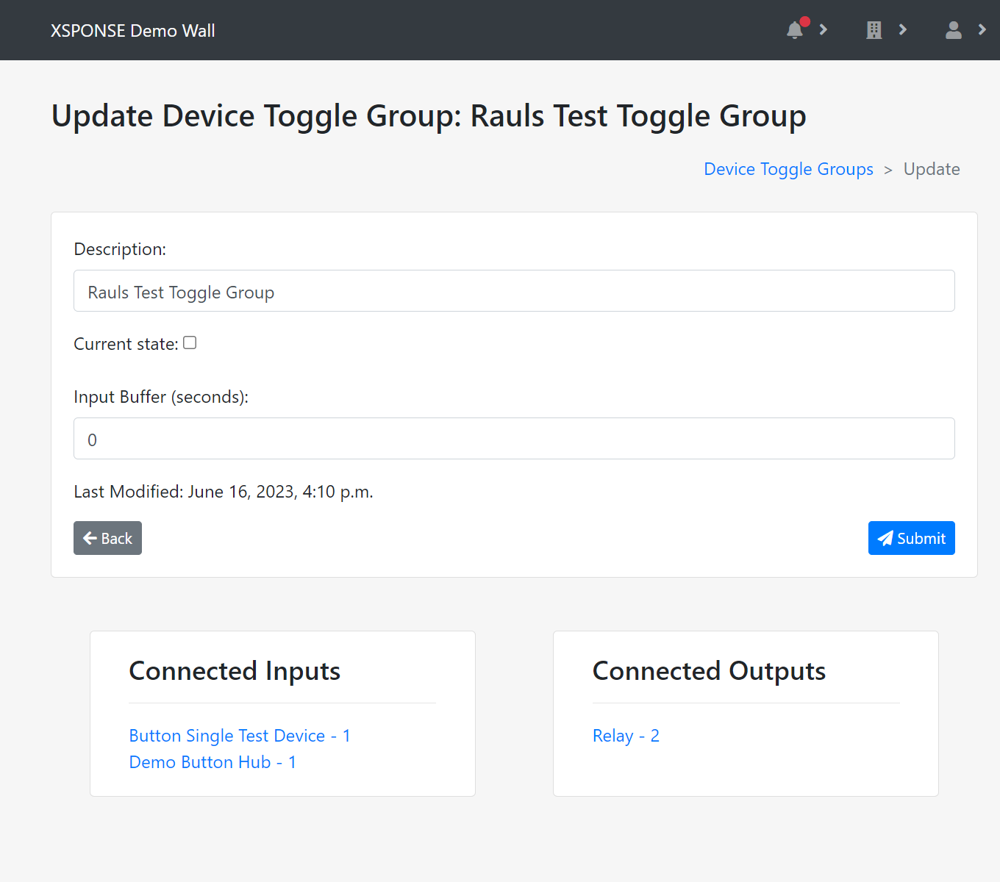

Related: [Action Plans](action-plans.md) \| [About Button Consoles](../button-consoles/about-button-consoles.md) \| [About Relay Consoles](../relay-consoles/about-relay-consoles.md) 

*Jump to how to [add](device-toggle-groups-management.md#add-a-toggle-group), [edit](device-toggle-groups-management.md#edit-a-toggle-group), or [delete](device-toggle-groups-management.md#delete-a-toggle-group) device toggle groups.*

Through device toggle groups, you can set one or more relay consoles to activate when one or more button consoles are triggered. For example, when a single XSPONSE button is pressed to indicate an emergency, it could trigger relays that activate lights and sirens in multiple locations. 

_To view larger: on a computer, right-click and select "open in new tab"; on a mobile touchscreen, use the zoom gesture._

The Device Toggle Groups table shows the groups by name, along with their state—*True* or *False*, indicating whether they're active or not. 

## Add a toggle group
To add a toggle group, select **Add Toggle Group** at the top right of the pane. This will open a separate pane allowing you to create the new toggle group. 

_To view larger: on a computer, right-click and select "open in new tab"; on a mobile touchscreen, use the zoom gesture._

Enter a description (name) for the toggle group, choose whether to set the *Current state* to true (selected) or false (unselected), and set the *Input Buffer*. Select **Submit** to save the new toggle group. Select **Back** or the **Device Toggle Groups** link in the upper right of the page (or in the navigation pane) to go back to the Device Toggle Groups management pane without saving the toggle group.

## Edit a toggle group
To edit a toggle group, select the **Edit** icon in the Device Toggle Groups table. This will open a separate pane allowing you to change the toggle group information. The Update Device Toggle Group pane also shows the *Connected Inputs* and *Connected Outputs* for the toggle group; these connections are set individually in the relevant device management panes.

_To view larger: on a computer, right-click and select "open in new tab"; on a mobile touchscreen, use the zoom gesture._

Once changes are made, select **Submit** to accept the changes. Select **Back** or the **Device Toggle Groups** link in the upper right of the page (or in the navigation pane) to go back to the Device Toggle Groups management pane without saving the contact.

## Delete a toggle group
To delete a toggle group, select the **Delete** icon in the Device Toggle Groups table. This will open a separate pane asking you to confirm contact deletion, or if any devices are still connected through this group, it will show the lists of *Connected Inputs* and *Connected Outputs* which link to the relevant panes where you can disconnect them. Select **Delete** to delete the toggle group. Select **Back** to go back to the Device Toggle Groups management pane without deleting the toggle group.

___
*Return to the [XSPONSE Service Guide index](index.md)*  
*Return to the [Button Consoles index](../button-consoles/index.md)*  
*Return to the [Relay Consoles index](../relay-consoles/index.md)*  
