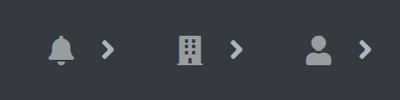
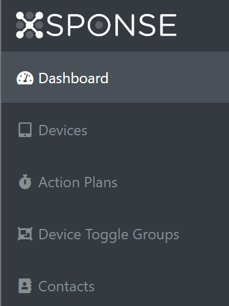

The main pane shows the relevant content for your current function. See the [Dashboard page](dashboard.md) for more information.

At the upper right above the main pane on every page throughout the site are three icons: a bell for alerts, a building for your company accounts, and a person for your user account.

-	Select the **Alerts** icon to show the alerts for your account in descending order by time (the most recent will be at the top of the menu). The account alerts notify you when one of your associated devices is disconnected. Select an alert to go to the management pane for that device. The alerts list is populated by company account and will be empty when you are viewing the Account Manager pane. See the help section for your devices for more information.
-	Select the **Accounts** icon to show the menu of companies you have access to—by default your own and, when applicable, additional ones. Select an entry from this menu to go directly to that company’s dashboard. Administrators can select the **Adjust** (gear) icon next to a company name in this menu to go to the Edit Company pane for that company. Select the **Manage all Accounts** link to go to the Account Manager pane. See the [Account Manager page](account-manager.md) for more information.
-	Select the **User** icon to show a menu with options to view and edit your profile, access the support page, and log out. The **Support** option appears when you are viewing the dashboard for a particular company account and will not be visible from the Account Manager pane. See the [Account Manager page](account-manager.md) for more information about accounts. See the [Dashboard page](dashboard.md) for more information about viewing and editing your profile.

The navigation pane also appears throughout the site along the left side, showing links to panes for managing your XSPONSE devices and functions, as well as company contacts and users. On the dashboard for a company, the following links will appear in the navigation pane.

-	Select the **Dashboard** link to go back to the main dashboard for your company.
-	Select the **Displays** link to expand the submenu for Digital Displays options—Sounds, Devices, Views, Playlists, and Schedules—then select one of these links to go to the relevant management pane. Selecting Displays a second time will collapse this submenu. See the [Digital Displays section](../digital-displays/about-digital-displays.md) for more information.
-	Select the **Button Consoles** link to go to the Button Consoles management pane. See the [Button Consoles Management page](../button-consoles/button-consoles-management.md) and the overall [Button Consoles section](../button-consoles/about-button-consoles.md) for more information. 
-	Select the **VapeDetect** link to go to the VapeDetect sensor management pane. See the [VapeDetect Management page](../vape-detect/vapedetect-management.md) and the overall [VapeDetect section](../vape-detect/about-vapedetect.md) for more information.
-	Select the **Relay Consoles** link to go to the Relay Consoles management pane. See the [Relay Consoles Management page](../relay-consoles/relay-consoles-management.md) and the overall [Relay Consoles section](../relay-consoles/about-relay-consoles.md) for more information.
-	Select the **Action Plans** link to go to the Action Plans management pane. See the [Action Plans page](action-plans.md) for more information.
-	Select the **Contacts** link to go to the Contacts management pane. See the [Contacts Management page](contacts-management.md) for more information.
-	Select the **Users** link to go to the Users management pane. This link will only appear for your company administrator, and other users will not see it. See the [Users Management page](users-management.md) for more information.

On the Account Manager pane and the User Profile pane, the only link visible in the navigation pane will be the Account Manager link. See the [Account Manager page](account-manager.md) for more information.

___
*Return to the [XSPONSE Service Guide index](index.md)*
