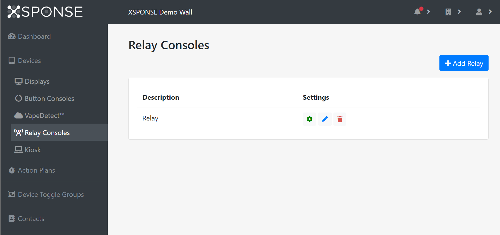
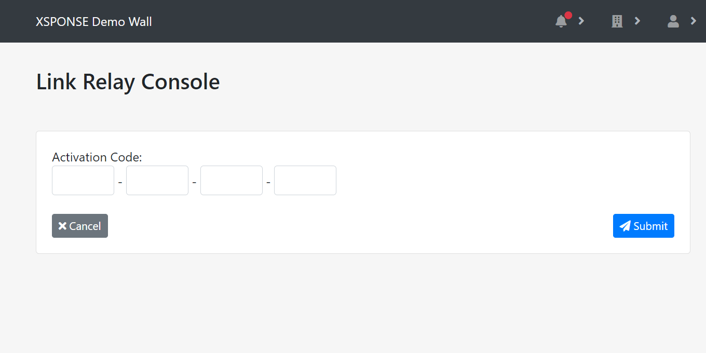

Related: [Action Plans](../general-ops/action-plans.md) \| [Device Toggle Groups](../general-ops/device-toggle-groups.md) \| [Incident Logs](../general-ops/incident-logs.md) \| [Contacts Management](../general-ops/contacts-management.md) 

*Jump to how to [add](relay-consoles-management.md#add-a-relay-console), [adjust](relay-consoles-management.md#adjust-a-relays-settings), [edit](relay-consoles-management.md#edit-a-relays-information), or [delete](relay-consoles-management.md#delete-a-relay-console) a relay console.*

The relay consoles table shows the relay consoles by description (name). 

_To view larger: on a computer, right-click and select "open in new tab"; on a mobile touchscreen, use the zoom gesture._

Relay consoles can be manually controlled from this pane, and also can be controlled automatically through *device toggle groups* or *action plans*. 
- A device toggle group allows multiple input and output devices to be grouped together so that triggering one of the input devices will cause the output devices to react. For example, a button console can be set to trigger if the button is held down for two seconds and cause relay consoles to activate flashing lights and sirens. See the [Device Toggle Groups page](../general-ops/device-toggle-groups.md) for more information.
- An action plan can be as simple as switching a relay console according to a schedule, for example allowing a set of lights to be turned on at nightfall and off at daybreak. Or it can incorporate the relay console into a more detailed plan, such as automatically shutting a machine off and sending an alert by SMS when a button console is activated in an emergency. See the [Action Plans page](../general-ops/action-plans.md) for more information.

Relay consoles are monitored by the XSPONSE service for connectivity; if a relay console goes offline, an alarm will be sent to the administrators.

## Add a relay console
To add a relay console and associate it with your account, select **Add Relay** at the top right of the pane. This will open a separate pane asking you to enter the activation code for the relay console, which can be found on a sticker on the device. Enter the code and select **Submit**.  

_To view larger: on a computer, right-click and select "open in new tab"; on a mobile touchscreen, use the zoom gesture._

A new pane will open asking you to give the device a description (name). Once you have set this option, select **Submit** to accept the settings. To go back to the relay consoles management page without linking a device, select **Cancel**.
 
## Edit a relay’s information
To edit the information for a relay console, select the **Edit** icon in the relay consoles table. This will open a separate pane allowing you to edit the relay description. Once changes are made, select **Submit** to accept the changes. Select **Cancel** to go back to the relay consoles management pane without saving any changes.

## Delete a relay console
To remove a relay console, select the **Delete** icon in the relay console table. This will open a separate pane asking you to confirm relay deletion. Select **Delete** to delete the relay console. Select **Cancel** to go back to the relay consoles management pane without deleting the relay console.

## Adjust a relay’s settings
To manage the settings for a relay console, select the **Adjust** icon in the relay consoles table. This will open a separate pane allowing you to see the name of the relay, its current state (on or off), the last time the service received a signal from the device, and two options for changing the relay's setting: a *Device Toggler* setting or a *New State* selection box. The *Device Toggler* allows you to assign the relay to a *device toggle group*, which will automatically change the relay's state when an input device, such as an XSPONSE button console, sends a trigger to that device toggle group. 

_To view larger: on a computer, right-click and select "open in new tab"; on a mobile touchscreen, use the zoom gesture._

To change the state of a relay immediately, select the box for that relay in the _New State_ column and choose the new state. To assign the relay to a device toggle group, select the **Device Toggler** box in that row and choose a device toggle group from the list. Once you have assigned a device toggle group or changed the state of the relay manually, select **Update** to accept the changes. Select **Back** to go back to the relay consoles management pane without saving any changes.

___
*Return to the [IP Relay Consoles index](index.md)*
