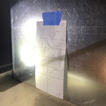
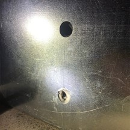
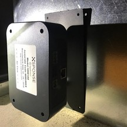
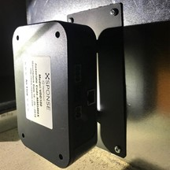
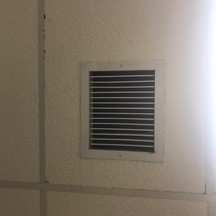

See the [Device Installation and Setup Requirements section](installation-reqs.md) before starting the installation process for important information on the [tools required](installation-reqs.md#tools-required), [ordering the sampling tubes](installation-reqs.md#ordering-the-sampling-tubes), and [choosing the location of your device](installation-reqs.md#location).

## Note before installation
The sampling tube includes an end cap. This end cap is critical to the proper operation of the sensor. Before installation, please ensure that the end cap is present and is properly seated in the end of the tube. If it is missing, please contact us for a replacement.

The actual sensor must be installed as shipped. Please do not switch the locations of the sampling and exhaust tubes. The sensor has a specially designed baffling system to direct the air into the sensors for more accurate measurements.

## Physical installation process
Once the location has been determined, use the included template (at the end of this document) to determine the location of the holes for the sampling tubes. The axis along the long side of the mounting plate should be in line with the airflow.

Mark the location of the holes on the sheet metal and drill two 7/8” holes 4” apart, following the template.

Use a small amount of the included gasket compound around each of the tubes to minimize any air leaks around the tubes.

Insert the sampling and exhaust tubes through the holes you just drilled until the mounting plate is flush with the sheet metal surface. 

> **Note**
> 
> The sampling tube (the longer tube) is always installed with the air inlet holes facing into the air flow. The exhaust tube ***must*** be installed downstream of the sampling tube.

Use the four supplied sheet metal screws to attach the mounting plate to the sheet metal ducting. 

***CAUTION: DO NOT OVERTIGHTEN THE SCREWS***

The sampling tube is painted flat black to blend in and make it more difficult to see in the duct work. To improve upon this, it is recommended that the inside of the metal box be painted flat black if needed. When it is done right, the sampling tube is virtually invisible.

## Device startup
Once the device is mounted to the ducting, it needs to be connected to a POE-enabled switch. The port must be configured to allow access to a DHCP server and to the Internet. Once it is connected to power, it will take about a minute to boot and stabilize. During this time, the LED will be yellow. 

> **Note on LED update**
> 
> For devices with an older version of the code, the LED will blink green when the sensors start up. When the device establishes a connection to our service, the LED will go steady green. Once the device sees there is a new version of code, it will update itself and restart. When it restarts, the LED will behave as described. The update process might take a short while, but you will eventually see the LED change colors to indicate its state.

When the sensors have stabilized and the device is ready to connect to the service, the LED will turn orange or white. Orange indicates that the device has contacted our service but it is not associated with an account. Please go to our website and associate the device with your account.  White indicates that the device has established communications with our service and is sending data successfully.

See the [VapeDetect section](vapedetect-management.md) for more information on associating your sensor devices with your account and managing them. 

For more information about the LED indicators and troubleshooting device communication problems, see the [Service Communication section](sensor-device-communication.md).

See the [Getting Started section](../general-ops/account-setup.md) for more information on setting up your XSPONSE account.
