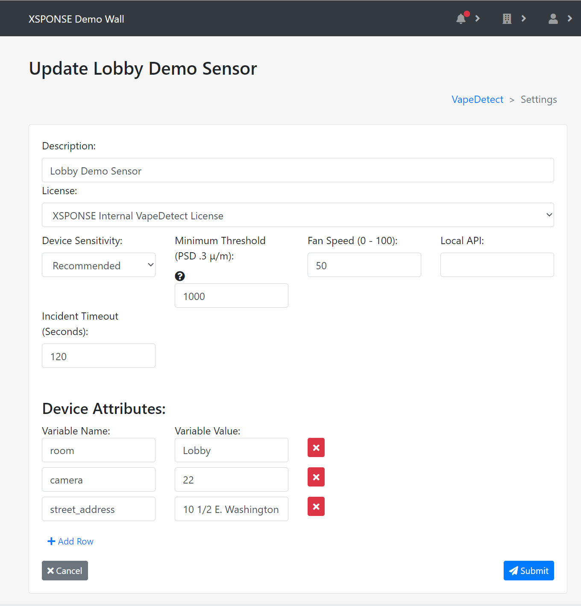
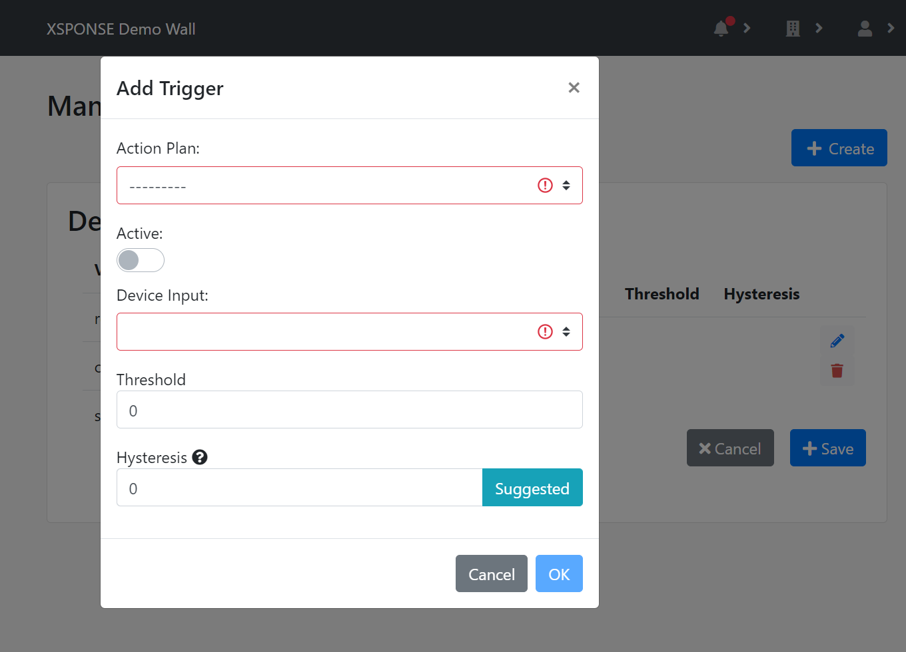

Related: [Action Plans](../general-ops/action-plans.md) \| [Incident Logs](../general-ops/incident-logs.md) \| [Contacts Management](../general-ops/contacts-management.md) 

*Jump to how to [add](vapedetect-management.md#add-a-sensor), [adjust](vapedetect-management.md#adjust-a-sensors-triggers), [edit](vapedetect-management.md#edit-a-sensors-information), or [delete](vapedetect-management.md#delete-a-sensor) a sensor device.*

When a sensor device starts, it checks the XSPONSE system to see whether it is associated with an account. Once the sensor is associated with your account, its LED indicator will turn white. See the [Device Installation Process page](installation-process.md) for more information. (Also see the [Sensor Device Communication page](sensor-device-communication.md) for full details on all the [LED color indicators](sensor-device-communication.md#led-color-indicators).)

_To view larger: on a computer, right-click and select "open in new tab"; on a mobile touchscreen, use the zoom gesture._

The VapeDetect table shows the devices by description (name), along with the version of code each device is running. 

## Add a sensor
To add a sensor and associate it with your account, select **Add Device** at the top right of the pane. This will open a separate pane asking you to enter the activation code for the device, which can be found either on the device label or a piece of paper included in the box. Enter the code and select **Submit**.  

_To view larger: on a computer, right-click and select "open in new tab"; on a mobile touchscreen, use the zoom gesture._

A new pane will open asking you to set the properties for your device: 

- Enter text in the **Description** field to identify the device; we recommend using its location.
- Select **License** to assign a license to your device. You will need to have added licenses to your account first.
- Select **Device Sensitivity** to choose an option from _Very Low_ to _Very High_ with _Recommended_ being the middle option. Start with _Recommended_ and adjust as needed later. 
- Enter a value in the **Minimum Threshold** box to set the minimum value required to trigger a VapeDetect alert. This threshold is specifically measuring the density of particles sized 0.3 microns per cubic meter of air (PSD .3 μ/m). We recommend you use *1,000* as the starting value, and adjust the value up or down over time as you use the sensor. If you are seeing false positives, especially in clean air, consider raising this value; if you think you are missing alerts, lower the value.
- **Fan Speed** is only used by the standalone sensor, not the duct-mounted sensor, and can be set from _0_ (off) to _100_.
- **Local API** can be used when the sensor is triggered to call a local web API to an internal application or a device. For example, if you are using our hub device, you can call an action plan on a local device. If you are using one of our relay or strobe devices, you can send it a command to activate for a specific period of time.

Also on this pane, you must set the device's attributes. _Device attributes_ are user-defined variables that allow action plans to provide relevant information about which device is sending an alert. By default, devices have two attributes, _room_ and _street\_address_, and you can add more. For example, for a large high school with multiple floors and buildings, all sensors could have attributes named _room, floor,_ and _building,_ and the unique values for each sensor would indicate its specific location. An action plan to alert staff when vaping is detected would use those variable names as placeholders in the alert message; this way, many devices can be assigned to the same action plan. When a particular sensor detects vaping and triggers the action plan, its values for those attributes would fill those variables in the action plan’s message, so that the alert notification would identify which specific sensor was activated. See the [Action Plans page](../general-ops/action-plans.md) for more information on using device attributes in action plans. 

Select the **Add Row** link to add more attributes or select the red **X** button at the end of a row to remove it. 

Once you have set these options, select **Submit** to accept the settings. To go back to the VapeDetect management pane without linking a device, select **Cancel**.
 
## Adjust a sensor’s triggers
To manage the triggers and action plans for a sensor device, select the **Adjust** icon in the VapeDetect table. This will open a separate pane allowing you to see the existing device attributes under _Device Info_ and the triggers with their associated action plans in the _Triggers_ table.

_To view larger: on a computer, right-click and select "open in new tab"; on a mobile touchscreen, use the zoom gesture._

To add a new trigger, select **Create** in the upper right of the pane. This will open a floating _Add Trigger_ window on top of the current pane. Select the **Action Plan** menu to choose a plan from those available. (See the [Action Plans page](../general-ops/action-plans.md) for more information.) Select **Active** to toggle the trigger between active and inactive. Select the **Device Input** menu to assign the trigger to one of the available sensor readings. Select the **Threshold** box to enter a value for the trigger, if desired; by default this is set to zero. Select **Hysteresis** to specify a buffer value for the trigger, which helps to manage fluctuations around the threshold value. Select the **Suggested** button next to this box to automatically enter the recommended value for the selected input. Once changes are made, select **OK** to accept the changes, or select **Cancel** to close the window without saving changes. 

_To view larger: on a computer, right-click and select "open in new tab"; on a mobile touchscreen, use the zoom gesture._

To change an existing trigger, select the **Edit** icon in the triggers table. This will open the floating Add Trigger window. To remove an existing trigger, select the **Delete** icon in the triggers table.

Once changes to the triggers table are made, select **Save** to accept the changes. Select **Cancel** to go back to the VapeDetect management pane without saving any changes. **NOTE** that you _must_ select **Save** to keep any changes you make to the triggers, whether adding a new one, editing an existing one, or deleting one.

## Edit a sensor’s information
To edit the information for a sensor, select the **Edit** icon in the VapeDetect table. This will open a separate pane allowing you to edit the device description, sensitivity, minimum threshold, and attributes, as described previously under [Add a sensor](action-plans.md#add-a-sensor). Once changes are made, select **Submit** to accept the changes. Select **Cancel** to go back to the VapeDetect management pane without saving any changes.

## Delete a sensor
To remove a sensor, select the **Delete** icon in the VapeDetect table. This will open a separate pane asking you to confirm sensor deletion. Select **Delete** to delete the sensor. Select **Cancel** to go back to the VapeDetect management pane without deleting the sensor.

___
*Return to the [VapeDetect index](index.md)*
